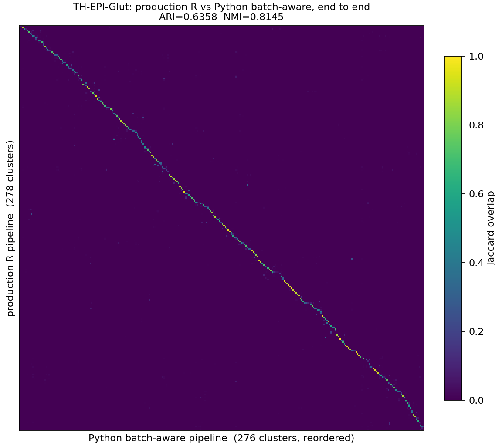

# `harmonize` series of scripts: how to do batch-aware merging

## goal

Supply the option of **batch-aware merging** into the Python pipeline by porting scrattch.bigcat's
`merge_cl_multiple` (`harmonize_merge.R`). Implemented as an option on the existing `merge_clusters`,
off by default — works identically in the per-level merge (onestep/iter_clust via hicatMPI) and in
the final merge:

```python
'merge_clusters_kwargs': {
    'thresholds': {...},                  # as before
    'de_method': 'ebayes',                # required in batch-aware mode
    'batch_aware_merging': {
        'batch_obs': 'platform',          # column of adata_norm.obs naming each cell's batch
        'lfc_conservation_th': 0.7,       # R lfc.conservation.th
        'conservation_lfc_th': 0.6931472, # OPTIONAL; defaults to thresholds['lfc_thresh']
        'thresholds': {                   # OPTIONAL per-batch overrides; unlisted batches
            '10X_nuclei_v3': {'q1_thresh': 0.3},   # inherit the shared thresholds above.
        },                                # (the WMB2 production setting: nuclei sample less RNA,
                                          # so their detection-rate bar is lowered -- any threshold
                                          # can be overridden per batch, e.g. score_thresh for a
                                          # shallow gene panel)
    },
}
```

Requires `de_method='ebayes'` and an in-memory AnnData. The full R-to-Python mapping and the port's
deliberate choices are in the [appendix](#appendix).

## the Python port

What maps to what:

| R (`harmonize_merge.R`) | Python |
|---|---|
| `get_cl_stats_list` (`:224`) — per-dataset statistics | `cluster_means.get_cluster_means_per_batch` |
| shortlist by embedding similarity (`:508`, `:514`) | `get_k_nearest_clusters` on `cluster_means_rd` (unchanged) |
| pre-filter: some dataset has >= `min.cells` of both (`:528-533`) | `_judge_pair_across_batches`, `judging` list |
| per-dataset `de_score` (`:117`) | `_de_one_pair` (from `de_all_pairs.py`) per batch, `want_detail=True` |
| `top.n = 1000` per direction (`:126`) | `CONSERVATION_TOP_N` |
| `lfc.conservation.th` gene filter (`:159-168`) | `_conserved_genes` |
| the filter's literal `lfc > 1` (`:167`) | `conservation_lfc_th` |
| `test_merge` per dataset + unanimity (`:379-396`, `merge_cl.R:11`) | `_judge_pair_across_batches` |
| `tapply(sc, pair, max)` pair ordering (`:394`) | `score` = max over judging batches |
| `de.score.th = mean(...)` for the half-threshold (`:399`) | `_half_threshold` |
| `pairBatch` lazy evaluation (`:549-567`) | `pair_batch` |
| weighted-average update after a merge (`:330-332`) | `_combine_rows`, per batch **and** pooled |
| `de_param.list` (per-dataset thresholds) | `batch_aware_merging['thresholds']` via `_resolve_batch_thresholds` |

Deliberate choices unique to the port:

- **Per-gene evidence comes from `_de_one_pair`, not `de_pairs_ebayes`** — the conservation filter
  needs gene *identity* per pair, which the summed-score path cannot supply. This also forces
  `de_method='ebayes'` (the chisq path reports positions, not gene names); requesting chisq raises.
- **DE engine differs**: R uses `fast_limma`, Python `ebayes` — characterized in report 6 as
  near-identical on this data.
- **Pooled statistics are carried alongside the per-batch ones** and updated with the same arithmetic
  as the pooled path, because the caller feeds them to marker selection.
- `merge_type='directional'` (merge when *either* direction is weak) is **not** ported; R defaults to
  undirectional.

### implementation details worth of noting

**For speed reasons, R does the following, and Python replicates them as options:**

- **`max.cl.size` subsampling** (R default 300): cluster statistics for the DE test are computed on at
  most N cells per cluster per platform. In R this goes through `sample_cells`, which calls
  `set.seed(NULL)` — reseeding from the clock — so R's production output is **not reproducible
  run-to-run**. Python exposes it as `thresholds['max_cl_size']` (default `None` = all cells). All
  comparisons here run both sides uncapped (for R that requires supplying `cl.stats.list` — see the
  next bullet; the `max.cl.size` argument alone does not do it).
- **`max.cl.size` is silently ignored for the cluster statistics.** Passing `max.cl.size=1e9` does
  **not** disable the sampling: `merge_cl_multiple` never forwards its `max.cl.size` argument to the
  internal `get_cl_stats_list` call that computes the statistics (`harmonize_merge.R:430`), so that
  call always uses its own default of 300 and draws a fresh random ≤300-cell sample per cluster per
  platform every run. The only way to run R's merge on full-population statistics — and the only way
  to make it reproducible — is to compute them yourself on all cells and pass them in via
  `cl.stats.list`. That is sufficient as well as necessary: statistics are computed once before the
  merge loop and updated by *exact* weighted combination after each merge (`merge_x_y`,
  `harmonize_merge.R:311-351`), so no later step re-enters the sampler (with cl.small pre-dissolved;
  the cl.small remap at `:488` is the one other data-touching path, and it too samples at 300).
  `_merge_R.R` now supplies `cl.stats.list`; so fed, R's merge is **byte-identical across runs and
  nodes** (test 1). Python computes its per-batch statistics on all cells and never samples unless
  `max_cl_size` is set, so supplying `cl.stats.list` is also what puts the two sides on the same
  evidence for comparison.
- **`pairBatch` lazy pair evaluation** (R default 100, `harmonize_merge.R:549-567`): candidate pairs
  are DE-tested in similarity-ordered batches of N, and a round stops testing as soon as *anything*
  in the cache is mergeable — pairs left untested wait for a later round. Cheaper, but which pair
  merges first then depends on how many pairs the round happened to compute. Python mirrors it as
  `batch_aware_merging['pair_batch']`, but the **default is `None` = test every shortlisted pair each
  round** — the same evaluation strategy the pooled merge (`merge_cl_big`) has always used, which has
  no lazy-evaluation history sensitivity and is where the two implementations match exactly (test 4:
  identical partitions). Production R ran at 100; test 4 compares both modes.

> **Why R is not reproducible — the two speed features above, combined.** The **cl-stats sampling**
> is the randomness source: a fresh, clock-seeded ≤300-cell sample per cluster per platform every
> run, so no two runs even start from the same statistics. **`pairBatch=100` is the amplifier**: a
> pair's DE score depends on which pairs share its evaluation batch (the variance-fit population)
> and lazy batching makes that batch composition follow the merge history — so the sampling's small
> statistical shifts reorder merges, evaluation histories fork, and borderline pairs land on
> opposite sides of `de.score.th=100` (six identical-input runs: pairwise ARI 0.9675-0.9971, 16 of
> 37 merge groups flipping — test 1). Neither feature alone breaks reproducibility the same way:
> with statistics supplied, R at `pairBatch=100` is byte-identical run to run (test 1) — but its
> lazy evaluation history is then still incidental, which is why deterministic production-R and
> Python can disagree on one history-sensitive pair while exhaustive mode matches exactly (test 4).

**Arbitrary conventions in R — not right or wrong, but Python adopts the identical choice so tied or
order-dependent decisions come out the same on both sides:**

- **Score-tie order.** Tied merge scores are common (a pair with no DE evidence anywhere scores
  exactly 0; the per-gene cap of 20 makes small round sums recur — the 326-cluster run had five
  0-score and five 20-score merges), and a tie decides which pair gets the round's unconditional
  merge. R breaks ties **alphabetically by pair name** — the two labels as strings, string-wise
  min/max joined by `_`, so labels 6 and 22 name the pair `"22_6"` — purely a side effect of
  `tapply`'s factor ordering plus a stable sort (`:394-395`). Python's `_r_pair_name` reproduces
  this byte-for-byte. (Before this, Python broke ties by list position, which for string labels
  depended on the per-process hash seed — silently non-reproducible.)
- **The conservation filter's fold-change bar is a literal `1` (log2)** (`:167`), not
  `de.param$lfc.th`. Python exposes it as `conservation_lfc_th`, defaulting to
  `thresholds['lfc_thresh']` — which equals R's literal for this pipeline (`ln 2`) but is a
  parameter rather than a buried constant.
- **`top.n = 1000` genes per direction** enter the conservation filter (`:126`) —
  `CONSERVATION_TOP_N` in Python.
- **The half-threshold for extra merges is the *mean* of the per-platform `de.score.th`** (`:399`),
  not the min — one strict platform cannot tighten the rule for the others. `_half_threshold` in
  Python.
- **Candidates come from the whole surviving cache**, not the current round's shortlist
  (`test_merge_multiple(de.genes.list)`, `:381`): a pair tested in an earlier round stays eligible
  even after centroid drift pushes it out of the k-NN, until a merge touching one of its clusters
  invalidates it. Python matches.
- **The variance-model population is the evaluation call's own clusters** — `de_selected_pairs`
  restricts to the clusters of the pairs it was handed (`de.genes.R:1152-1154`, then size-filtered
  by `min.cells`), so a pair's score depends on which pairs shared its evaluation chunk and on the
  round it was first scored in. Python fits per evaluation chunk over the chunk's clusters,
  matching. (Two earlier readings — "all clusters ≥ 1 cell", then "all clusters ≥ min.cells" — were
  both wrong; the engine-internals probe settled it.)
- **Small-cluster handling follows the merge mode.** Pooled: a cluster below `cluster_size_thresh`
  *pooled* cells is merged whole into its nearest reduced-space centroid (R `merge_cl_big`,
  `merge_cl.R:97-125`). Batch-aware: a cluster below `min.cells` in **every batch** is **dissolved**
  -- its cells remapped individually to the nearest big-cluster centroid by cosine (R
  `merge_cl_multiple`, `harmonize_merge.R:406-495`; `map_cells_knn` Annoy.Cosine). The dissolve is
  essential, not cosmetic: such clusters are unjudgeable by every batch, and unjudgeable pairs never
  merge, so without it they survive to the output unvetted -- the test-4 input had accumulated
  **22 of 348** such clusters before this was ported. Note the remap is an **approximate** KNN
  (Annoy, cosine) on both sides -- yet the dissolve outcome is the **same** in practice: the
  post-dissolve clustering was md5-identical across all eight R runs of test 1 (361 remapped cells,
  byte-for-byte), and Python's ported dissolve is likewise cell-identical across runs and nodes
  (test 2). Annoy is deterministic given a fixed index build; the approximation only means a cell
  *could* land on a near-tied second-best centroid, not that the answer varies run to run.
- **Merge destination is the larger cluster** (`merge_x_y` sorts by size, `:317-320`). Python keeps
  the pair's first label instead — the one place we deliberately do NOT match, because only the
  surviving *label* differs; the merged cluster's membership is identical, so ARI and merge groups
  are unaffected.

**One R detail neither replicated nor triggered:** `get_cl_stats_list` defines `present` as `x > 1`
below 50,000 cells per platform (in-memory path) and `x > 0` at or above it (parquet path) — two
different detection rules in one function (`:253-260`). On log2(CPM+1) at 10x depths both rules mark
the same genes, so it is inert here; see "R's 50,000-cell branch" below.

**How closely the two sides' cluster statistics agree** (the pre-flight check, run before every
comparison): `present` is **exactly identical** (integer-derived, and the log2→ln rescale is exact
for both values and thresholds); `means` and `sqr_means` agree to ~3e-7 / ~2e-6 absolute — i.e. they
differ from the **7th significant digit**, the precision of the float32 h5ad export Python reads
(R computes from its float64 parquet store). In exact arithmetic they are the same quantity. Note
this ~1e-7 input difference is well above the 1e-16 level proven harmless, so it is a possible
contributor — alongside the ebayes-vs-fast_limma engine delta — to the residual borderline-pair
disagreements.

### tests

**The headline result, stated precisely.** Given the same input, the batch-aware merge reproduces
deterministic R's decisions exactly — ARI 1.000000 on the first-step clusters (test 3) and on the
326-cluster recursion in both evaluation modes (test 4). But that is a **measured** outcome, not a
mathematical guarantee: test 4-2 runs the same comparison on a different input and finds two
disagreements (ARI 0.999599), both pairs whose scores sit within ~1% of the `de.score.th=100` cutoff,
where the `ebayes`-vs-`fast_limma` offset decides the call. The accurate claim is therefore: **the
rule is identical, and decisions match unless a score falls inside that sliver — in which case Python
merges and R does not.** See the boxed note in test 4 for why, and test 4-2 for the instance.

`tests/test_merging_batch_aware.py`, 24 tests, all passing (run inline; the `tc` env has no pytest).
The two that carry the argument: `test_contradictory_difference_merges` (genes flipping direction
between batches are filtered and the pair merges — **while the pooled merge on the same data keeps it
split**, so the test proves the batch logic did the work) and `test_one_objecting_batch_vetoes`.
Several pin R's constants and conventions directly against `harmonize_merge.R` line numbers
(half-threshold mean, conservation denominator and bar, `top.n`, tie naming), because behavioural
tests built from one's own understanding cannot detect an error in that understanding — every
threshold constant in the first draft of this port was wrong until checked against the R source.

## Test 1 — R vs R: the reference's own reproducibility

**Finding: R's merge is nondeterministic for exactly one reason — the hidden statistics subsampling —
and becomes byte-reproducible once that is removed.** (See the `max.cl.size`-is-silently-ignored
bullet under implementation details: without an explicit `cl.stats.list`, `merge_cl_multiple`
computes its statistics on a fresh random ≤300-cell sample per cluster per platform, reseeded from
the clock every run — regardless of the `max.cl.size` argument.)

(These runs use R on its **native** per-platform gene spaces, not the shared intersection matrix of
tests 3-4, so their cluster counts are not directly comparable with those tests. Nothing here depends
on the gene space: the finding is about R's internal sampling.)

**Before the fix** — six runs of the identical script on byte-identical inputs (same post-dissolve
clustering, md5-checked), **all at R's production `pairBatch=100`** and with `max.cl.size=1e9`
passed (which, per the note above, the internal statistics call ignores); the runs differ only in
node and `mc.cores`:

| run | node | mc.cores | merges (326 clusters ->) | pair `184_42` scored |
|---|---|---|---|---|
| r3 | n72 | 10 | 38 -> 288 | 30.35 |
| r4 | n79 | 10 | 39 -> 287 | 31.41 |
| r5 | n250 | 10 | 40 -> 286 | 31.12 |
| r6 | n250 | 10 | 42 -> 284 | 30.18 |
| s1 | n250 | **1** | 41 -> 285 | 31.41 |
| s2 | n250 | **1** | 38 -> 288 | 30.38 |

**How the six runs differed.** Pairwise ARI spans **0.9675-0.9971** over the 15 run pairs (worst:
r4 vs s1; best: s1 vs s2 — note the two single-core runs are each other's *closest* pair yet still
differ, so single-threading does not help). Across the six runs **37 distinct merge groups** appear,
but only **21 are found in all six**; the other 16 come and go with the sample, including the same
borderline pairs that later show up in the R-vs-Python comparison — `{148,296}` (3/6 runs),
`{203,343}` (3/6), `{104,333}` (3/6), `{326,330}` (4/6), `{181,28}` (4/6) — and regroupings such as
`{110,158,272}` vs `{110,158,272,277}` (3/6 each): R disagrees with itself about where cluster 277
attaches. A single pair's score wanders over a 1.2-point range (table above), and pairs hugging
`de.score.th=100` flip (`{203,343}` merged at 99.94 in one run, declined in another).

The suspects were eliminated one at a time by replaying the same evaluation
batch under controlled conditions: the 1e-16 float jitter between runs' statistics exports —
**no effect** (bit-identical scores); `mc.cores` 1 vs 10 — **no effect**; node (n72 vs n79 vs n104)
— **no effect** (all bit-identical at 30.81373); the merge run twice inside one R session with
statistics supplied — **byte-identical**. Only the subsampling remained, and single-core runs on one
node still differing (s1 vs s2) confirms it: the randomness is `sample()`, not parallelism.

**Parallel-run comparisons, before vs after the fix** (`_merge_R.R` after the fix passes its
all-cells statistics via `cl.stats.list`; every run below is `pairBatch=100`, so the only change
between the two configurations is the statistics):

| statistics | run pair (nodes) | merges | ARI | merging exactly the same? |
|---|---|---|---|---|
| sampled (before fix) | r3 vs r4 (n72, n79) | 38 vs 39 | 0.9818 | no |
| sampled (before fix) | r5 vs r6 (both n250) | 40 vs 42 | 0.9874 | no |
| sampled (before fix) | s1 vs s2 (both n250, 1 core) | 41 vs 38 | 0.9971 | no |
| **supplied, all cells (after fix)** | det1 vs det2 (n287, n292) | 39 vs 39 | 1.0 | **yes — output files byte-identical (same md5)** |

Practical conclusions: R's merge is fully deterministic **iff** the statistics are supplied;
its production configuration (`max.cl.size=300`, no `cl.stats.list`, unseeded) is *never*
reproducible run-to-run, and nothing you pass to `merge_cl_multiple` short of `cl.stats.list`
changes that. All R arms in tests 3-4 below run with `cl.stats.list` supplied.

## Test 2 — Python vs Python: the port's reproducibility

The identical comparison job run twice, scheduled by SLURM onto **different nodes** (n280, n110),
each computing the full batch-aware merge of the 326-cluster input from scratch; the merged labels
of both runs were written to file and diffed **cell for cell**:

| | run A (n280) | run B (n110) |
|---|---|---|
| clusters | 286 | 286 |
| labels identical, all 285,230 cells | **yes — exact** | |

No ARI needed: the outputs are the same file. This is by construction, not luck — the port contains
no random sampling, breaks all score ties by cluster labels rather than memory order, evaluates in a
fixed order, and sums statistics deterministically. Python needs no equivalent of the
`cl.stats.list` workaround: it computes per-batch statistics on all cells unless `max_cl_size` is
explicitly set.

## The gene space used for all comparisons — and how it differs from R's native setup

**This applies to tests 3, 4 and 4-2 alike.** Both implementations receive **one h5ad on the
intersection gene space** — the 21,205 genes present in all three platforms' references — and no
`genes_by_batch`. That is what a combined h5ad normally is, and it is the fair way to compare two
implementations: identical evidence on both sides, so any difference is the merge rule.

R natively works from three *separate* matrices with different gene lists (32,285 / 32,285 / 21,899).
So this configuration is deliberately **not** R's native one, and the consequence must be stated
plainly:

**On the intersection axis the merge is more permissive — it merges more — because modality-specific
DE genes are not there to prevent merging.** A gene present in only one platform's reference is
judged by that platform alone (1 of 1 measurers agree = 100%), survives the conservation filter, and
adds to that platform's separation score, where it can veto a merge single-handedly. Intersection
deletes those ~11,800 genes before the merge runs, so that veto evidence never exists.

The effect is measurable **within R itself**, which removes any implementation question — the same
303-cluster input, the same code, only the gene space changing:

| R's gene space | result |
|---|---|
| native, three references (32,285 / 32,285 / 21,899) | 303 -> **280** |
| restricted to the 21,205-gene intersection | 303 -> **278** (ARI 0.9976 vs the above) |

Two extra merges on that input; on the 326-cluster input of test 4 the two gene spaces happened to
give the identical partition, so the size of the effect is input-dependent, not fixed.

**When it matters, the remedy is upstream, not in the merge**: build the combined matrix on the
*union* of the references and pass each platform's gene list as
`batch_aware_merging['genes_by_batch']`, which restores R's native accounting exactly (a platform
votes on a gene only if its reference contains it). No merge-side setting can recover evidence that
an inner join already discarded.

## Test 3 — R vs Python, on first-step clusters -> test the batch-aware merging

### the test data

**WMB2 whole-mouse-brain multi-platform clustering**, neighborhood **`TH-EPI-Glut`** — one of the nine
in `nh9` (`/home/changkyul/CK/WMB2/nh9.rda`), chosen as the smallest whose three platforms all sit on
the same side of R's 50,000-cell `present` branch. Production call site:
`/home/changkyul/CK/WMB2/deNovo_nh9_v7/QSUB/run_iter_cluster.R`.

| | |
|---|---|
| cells x genes | **285,230 x 21,205** (gene intersection across the three platforms; 1.4B nonzeros) |
| platforms (the batches) | `10X_cells_v3` 58,831 · `10X_cells_v2` 76,623 · `10X_nuclei_v3` 149,776 |
| expression | `comb.dat` `big.dat`, log2(CPM+1), exported to `expr.h5ad` (11.2 GB, float32) |
| embedding | 32-dim scVI, `TH-EPI-Glut_all_scVI.csv` |
| input clustering | **Python** `cluster_louvain` on the latent — k=15, leiden, euclidean, `jaccard_prune = 1/(k-1)` -> **39 clusters** (420-17,842 cells each) |
| thresholds | the relaxed per-platform `de.param` from `run_iter_cluster.R:54-70`; listed per arm in the result table |

**The design.** One Python clustering and **one expression matrix** are handed to *both* merge
implementations, so the comparison isolates the merge rule — no clustering-algorithm difference and no
evidence difference enters.

The matrix is the **intersection gene space**: `expr.h5ad`, the 21,205 genes present in all three
platforms' references. This is what a combined h5ad normally is, and it is given to both sides — R's
statistics are restricted to the same 21,205 genes (`_merge_R.R`'s `isect` mode), so every platform
sees exactly the same genes. **No `genes_by_batch` is set**, and none is needed: on an intersection
axis every gene is in every platform's reference, so "every platform votes on every gene" is the
correct accounting for both implementations. (What this configuration costs relative to R's native
three-matrix layout is measured in *The gene space used for all comparisons*, above.)

Each side computes its own per-batch statistics from that matrix on **all cells**. R runs with
`joint.rd.dat` supplied (so its shortlist uses the same embedding) and with those all-cells statistics
passed via `cl.stats.list` — which, per test 1, is what actually makes R deterministic
(`max.cl.size=1e9` alone does not).

**Inputs verified before any merge** (else a merge disagreement would be uninterpretable): Python's
per-batch statistics vs R's, on all 39 clusters x 3 platforms — `present` **bit-exact**, `means` and
`sqr_means` within float32 transport noise (max 3.6e-7 against a 1.6e-6 float32 floor). `present`
being exact matters most: it is a rational `k/n` landing precisely on round thresholds like `q1.th`.
A separate check confirms the matrix really is log2(CPM+1) (integer-multiple structure of recovered
CPM), since the `x ln2` rescale and threshold conversions assume it and nothing downstream would
catch a wrong base.

### the result

Same 39-cluster input handed to every arm. Two experiments: **production thresholds** (nuclei's
`q1.th` relaxed to 0.3, as `run_iter_cluster.R:54-70` sets it) and **uniform-q1** (all platforms
0.4), which removes the threshold difference so a pooled-vs-batch-aware disagreement is attributable
to the method alone.

| arm | q1.th (v3 / v2 / nuclei) | clusters | merge group | ARI vs R | runtime* |
|---|---|---|---|---|---|
| R batch-aware `merge_cl_multiple` | 0.4 / 0.4 / **0.3** | 39 -> **37** | `{6, 7, 22}` | — | 31.5 s |
| **Python batch-aware** (this port) | 0.4 / 0.4 / **0.3** | 39 -> **37** | **`{6, 7, 22}`** | **1.000000** | 276.8 s |
| Python pooled (original), control | 0.4 (single pooled test) | 39 -> 37 | `{6, 7, 18}` | 0.913228 | 219.7 s |

Both merge arms run **exhaustively** (every shortlisted pair scored each round — Python's default and
R `pairBatch=1e9`).

Shared parameters, all arms: `de.score.th=100`, `min.cells=10`, `min.genes=5`, `padj.th=0.01`,
`q.diff.th=0.7`, `lfc.th`/`low.th` = 1 (log2) = `ln 2` (Python), `lfc_conservation_th=0.7`,
`compare.k=4`, `max.cl.size` off (all cells).

The pooled control is **one row because it is one configuration**: the pooled merge computes a single
detection rate over all cells, so it has no per-platform thresholds for the uniform-q1 experiment to
change — the two experiments' controls coincide by construction. It was nonetheless executed in both
(different jobs, different nodes) and produced the identical result, which doubles as an empirical
determinism check on the pooled path.

\* runtimes only where all three arms ran in ONE allocation on one node (n266) — required, because
identical code on this cluster varies **~1.8x across nodes** (measured on the same computation), more
than any difference between the implementations. The uniform-q1 arms ran on other nodes; their
timings are omitted.

**Final-configuration confirmation.** After every later fix (correlation shortlist with
self-in-top-k, exact post-merge variance, destination = larger cluster, R-style tie order,
`cl.small` dissolve), the experiment was rerun end to end in the configuration above: **ARI
1.000000**, identical merge groups, pooled control unchanged (0.913228). A uniform-q1 variant (all
platforms at 0.4, removing the per-platform threshold difference) was run earlier and gave the same
answer — `{6,7,22}` batch-aware, `{6,7,18}` pooled — so the pooled/batch-aware flip below is
attributable to the method, not to nuclei's relaxed `q1.th`.

Two conclusions, one per experiment:

- **The port reproduces R** (rows 1-4): ARI 1.000000 on all 285,230 cells, in both threshold
  configurations. The pooled control is what makes that meaningful — the two merge rules **disagree
  on this data**, and the port lands on R's answer rather than the pooled one, so the agreement is
  discriminating, not an artefact of nothing ever merging.
- **The pooled/batch-aware flip is the method, not the threshold** (row 5 vs rows 1-4): pooled picks
  `{6,7,18}` and batch-aware picks `{6,7,22}` **whether or not** nuclei's `q1.th` is relaxed. The
  genes separating 22 from `{6,7}` do not point the same way across platforms — the conservation
  filter discards them as batch effects, collapsing 22's score; the pooled merge counts them and
  keeps 22 apart while merging 18 instead. That is the failure mode batch-aware merging exists to
  prevent, observed on real data under both threshold settings.

**Runtime anatomy** (step timings from one same-node pair of Python arms): batch-aware costs ~2-3x
the pooled merge end to end. Two causes: the per-batch statistics are **a second full pass over the
matrix**, and the merge loop itself is **~80x slower** — pooled runs one eBayes fit per round and
sums a score, batch-aware runs one fit *per batch* per round and materialises a per-gene detail frame
for every pair so the conservation filter has gene identities to work with. That is the real price of
the feature, and why it is opt-in.

**What this does not establish.** Of ~100 pairwise verdicts, only **2 were "merge"**, so the
positive direction rests on few decisions (the pooled control addresses *whether* the test can
discriminate, not *how many* merge decisions were checked) — that is what test 4 covers. Neither the
mean-vs-min half-threshold fix nor `cl.small` handling is exercised by this dataset (0 of 39 clusters
fall below `min.cells` everywhere, so both sides' small-cluster handling is a no-op here).

## Test 4 — R vs Python final merge, on full recursive clusters

### the test data

Input: the Python pipeline's full recursive clustering of `TH-EPI-Glut` (hicatMPI, batch-aware
merging at every level, `split_size=100` = R `i_harmonize`'s default) — **348 clusters**, reduced to
**326** after dissolving `cl.small` (22 clusters below `min.cells` in every platform; done once in
the harness so both sides provably start identical, and since ported into `merge_clusters`'
batch-aware branch).

Gene space and thresholds exactly as in test 3: **one h5ad on the 21,205-gene intersection, given to
both sides** (R's statistics restricted to the same genes), **no `genes_by_batch`**. Inputs verified
per platform before any merge: `present` bit-exact, means/sqr_means at float32 transport noise.

### the result

Both R arms are **deterministic runs** (`cl.stats.list` supplied, test 1); both Python arms are the
final code, verified cell-for-cell identical across nodes (test 2).

| config | R (deterministic) | Python | ARI | merge groups identical |
|---|---|---|---|---|
| exhaustive (`pair_batch` off) | 326 -> **285** (41 merges) | 326 -> **285** | **1.0000000** | **30 of 30 — identical partitions** |
| production (`pair_batch=100`) | 326 -> **285** | 326 -> **285** | **1.0000000** | **30 of 30 — identical partitions** |
| pooled control | — | 326 -> 256 (70 merges) | 0.7776 vs R batch-aware | 12 of 30 / 40 |

**The port and deterministic R produce the identical partition, in BOTH evaluation modes** — every
one of 41 merge decisions, all 30 merge groups, ARI exactly 1.0, exhaustively and at R's production
`pairBatch=100`.

> ### ARI 1.0 is a MEASURED result, not a mathematical guarantee
>
> **Test 4-2 proves this, and is not a hypothetical**: same code, same gene space, same thresholds,
> same exhaustive mode — **only the input clustering differs** — and agreement drops from 1.0 here to
> 0.999599 there, on two pairs. Read the two tests together, never test 4 alone.
>
> **Why exact agreement cannot be guaranteed.** The two sides never compute identical scores: the DE
> engines differ (Python `ebayes` vs R `fast_limma`, ~0.2-1% in the t-statistic on the same fit), and
> Python reads a float32 export while R reads its float64 store (statistics differing from the 7th
> significant digit). Every score therefore carries a small offset, and the merge rule is a hard
> threshold — so a pair landing inside that sliver around `de.score.th=100` merges on one side only.
> Whether any pair lands there depends on the data.
>
> **What IS guaranteed by construction, in exhaustive mode**: such a disagreement can only ever be a
> *direct offset on a single pair*, never a cascade. Both sides score every shortlisted pair every
> round, so their evaluation contexts stay locked together and one differing decision cannot fork the
> merge history (the `pairBatch` mechanism of test 1). Test 4-2 bears this out — its two disagreeing
> pairs are isolated, every other decision matched.
>
> **The offset has a consistent sign, so the failure mode is directional.** On all five near-threshold
> merges both sides made in test 4-2, Python scored *lower* than R (50.69/61.64/63.54/81.55/93.46 vs
> R's 50.88/61.84/63.66/82.62/93.56). A pair scoring just *above* 100 in R is therefore at risk of
> falling *below* it in Python — which is exactly what happened (Python's extra merge at 98.96) —
> while the reverse is unlikely. Expect any future disagreement to be **Python merging slightly more
> at the margin, not less**. (Five observations plus a mechanism: a consistent tendency on this data,
> not a proven law.)
>
> **So the accurate claim for the port is not "identical" but:** the merge rule is identical, and
> decisions match exactly unless a pair's score sits within ~1% of the cutoff — in which case Python
> merges and R does not. That is a stronger statement than an ARI, because it comes with a stated
> failure mode, a direction, and a bound.

**Production `pairBatch=100` agrees too, on this input.** Lazy evaluation makes a pair's score depend
on which pairs share its evaluation batch (mechanism 3 below), so the two sides' batch histories can
in principle diverge — on an earlier union-gene-space run of this same input it did, by exactly one
borderline merge (`{148,296}`, 139 cells, which exhaustive R also merges). Here both modes land on
the same 285 clusters. Earlier residuals reported in this section (ARI 0.9917, flip-flopping groups
`{104,333}`, `{326,330}`, `{203,343}`) were **entirely R's hidden statistics sampling** (test 1):
they stopped flipping the moment R ran on full-population statistics.

("merge groups identical": a merge group is a set of starting clusters fused into one final cluster;
the column counts groups whose membership matches exactly between R and Python. Unique groups:
none, in either mode.)

**What `pair_batch=100` buys in runtime: ~1%.** Measured properly — one allocation on one node
(n94), inputs loaded once, two interleaved repetitions of each mode — the Python merge takes
307.4/308.5 s at `pair_batch=100` vs 310.3/311.6 s exhaustive: a 3.0 s (1.0%) saving, real
(within-mode repeats agree to ~1 s) but negligible, and far below the ~1.8x that identical code
varies across nodes. On this data most rounds are small re-scoring rounds with little left to skip,
so the lazy evaluation saves almost nothing while costing the exact-agreement property above.
(The same job also re-confirmed reproducibility: its `pair_batch=100` labels are cell-identical to
the earlier run on a different node.)

The pooled control again shows the method effect dwarfs the residual implementation gap: pooled
makes ~70 merges where batch-aware makes ~41, at ARI ~0.79 against either batch-aware arm.

> **The pooled merge itself has a known, larger R-vs-Python gap than the batch-aware merge.** The
> pooled implementations were compared head-to-head on a shared input in report 5
> (`5_final_merging.md`): ARI **0.997**, 433 of 454 clusters handled identically — close, but never
> exact. The root difference there is the **candidate shortlist**: R's `merge_cl_big` finds
> candidate pairs with approximate annoy (~98.4% recall at 454 centroids), Python with exact
> `scipy.cdist`, so R sometimes never tests the true nearest pair (10 of the 21 disagreeing clusters
> are "merged by both, with different partners"), and the remainder are the familiar borderline/
> cascade flips. The batch-aware port avoids this class of gap by construction — its shortlist is an
> exact replica of R's (dense correlation + top-k, no approximation on either side), which is part of
> why test 4 can reach ARI 1.0 where the pooled comparison plateaus at 0.997.

### where the divergence came from — the attribution chain

Every step below is the same input and exhaustive evaluation; only the named defect changes:

| configuration | ARI | disagreeing groups |
|---|---|---|
| first run (Euclidean shortlist, 4 real neighbours, intersection gene axis, old tie/variance handling) | 0.964 | 8 + 12 |
| + audit-3 fixes (correlation shortlist w/ self-in-top-k, exact variance, larger-cluster destination, R tie order) | ~0.97 | fewer; several groups snap to R |
| + gene axes matched (control: BOTH sides restricted to the 21,205-gene intersection) | 0.9978 | 3 |
| + full per-platform axes (Python via `genes_by_batch`) | 0.974 exhaustive / 0.990 production | 5 + 5 |
| + variance fit per evaluation chunk (audit 4, below) | 0.974 exhaustive / 0.9947 production | 1 + 3 (production) |
| + deterministic R reference (test 1: `cl.stats.list` supplied — the rows above compared against sampled R) | 1.0000000 exhaustive / 0.9999981 production | 0 (exhaustive) / 1 (production) |
| + one intersection-axis matrix for BOTH sides (the configuration of tests 3-4 above) | **1.0000000 in both modes** | 0 |

Rows 3-6 were measured on the union gene axis, because closing the gene-axis defect (mechanism 2)
required giving Python the genes R could see. The final row is the configuration the tests now
report: a single intersection matrix shared by both sides, where the axis question does not arise.

Four mechanisms accounted for everything traceable:

1. **The candidate shortlist.** Python was proposing pairs by normalized Euclidean distance with 4
   real neighbours per cluster; R's `merge_cl_multiple` uses Pearson correlation with self among the
   top-k (3 real neighbours at `compare.k=4`). Different pairs proposed -> merges one side never
   even tested.
2. **The gene axis.** R runs each platform's DE on that platform's own gene list, and a gene
   measured by ONE platform passes the conservation filter trivially (`set.num=1`) — single-platform
   evidence counts. The h5ad export carried only the 21,205-gene intersection, hiding ~11k union
   genes from Python. Found by a per-gene probe of one divergent pair (`111_276`: R score 20 vs
   Python 0): the entire gap was one nuclei-only gene, `Gm26992`, at `-log10(padj)=50` in R and
   invisible to Python. The pre-flight had not caught it because it, too, compared statistics only
   on the intersection — a verification blind spot, since closed (each platform now checked over its
   full own axis). Note this defect was an *asymmetry*: R saw genes Python did not. Tests 3-4 remove
   it by construction — one matrix, one axis, both sides — and the cost of that axis relative to R's
   native three references is measured separately above.
3. **The variance-fit population** (audit 4). An engine-internals probe first DISPROVED the obvious
   suspect: given the same fit design, `fast_limma` and `ebayes` agree to ~1% in t (Syt6 t = -13.850
   vs -13.761; identical df, stdev.unscaled, near-identical prior) — the engines were never the
   problem. The real difference: R's `de_selected_pairs` fits its variance model over **only the
   clusters of the pairs handed to that call** (`select.cl <- unique(c(pairs$P1, P2))`,
   `de.genes.R:1152-1154`), not all live clusters. Round 1 (hundreds of pairs, most clusters) ~
   an all-cluster fit, so early merges agreed to two decimals; late rounds fit over a handful of
   clusters, per-gene variances shrink non-uniformly (one gene's padj moved 5 orders of magnitude),
   and scores jump — which is how R merged pairs at 80-94 that Python had cached as vetoes. A
   notable property this implies about R itself: **a pair's DE score depends on which other pairs
   shared its evaluation batch** (with `pairBatch=100`, on chunk composition). Python now fits per
   evaluation chunk over the chunk's own clusters, matching both modes.
4. **Unjudgeable pairs and batch membership.** R drops pairs no platform can judge BEFORE batching
   (`:528-533`); Python dropped them at verdict time — decision-equivalent, but batch membership
   sets the fit population, so an unjudgeable pair inside a Python chunk changed every chunk-mate's
   score (observed: an unjudgeable rank-5 pair displacing the rank-101 pair R evaluated instead).
   Python now pre-filters the shortlist identically.

The single-pair probes that drove this: given the SAME evaluation batch, R and Python agree at every
stage — statistics bit-exact, same DE genes, engines within 0.2% (pair `306_50`: pre-conservation
97.46 vs 97.23), identical conserved set and final score (40.0 = 40.0, genes `Nfib` +
`6330411D24Rik`).

### the residual, bounded and explained

Against deterministic R on this input the residual is **zero in both evaluation modes** — identical
partitions, ARI 1.0. Everything reported as residual in earlier drafts (`{104,333}`, `{326,330}`,
`{203,343}`, `{148,296}`, the 277/153/202 regroupings) is gone: those were R's hidden statistics
sampling (test 1) and, for `{148,296}`, a `pairBatch` evaluation-history effect on a union-gene-space
run of the same input.

**That is a measured outcome, not a mathematical guarantee** — and test 4-2 below shows the exception
occurring on a different input, which is worth reading as the honest bound on this result. The two
sides never compute identical scores: the DE engines differ (Python `ebayes` vs R `fast_limma`,
~0.2-1% in the t-statistic on the same fit) and Python reads a float32 export while R reads its
float64 store. Every score therefore carries a small direct offset, and the merge rule is a hard
threshold, so a pair whose score lands inside that sliver around `de.score.th=100` merges on one side
only. What exhaustive evaluation guarantees is that this sliver is the **only** possible source of
disagreement — both sides score every shortlisted pair every round, so evaluation contexts stay
locked and a small difference cannot fork the merge history and cascade.

The `{148,296}` history from the union-axis run is still the clearest illustration of the
context-dependence, using R's own numbers. That pair is judgeable only by `10X_cells_v3` (the
clusters have 13 and 10 cells there; the other platforms hold too few and vote merge), and both sides
conserve the **identical 9 genes** (Kcnh1, E130114P18Rik, Angpt1, Sorcs1, Arhgef26, Nfia, Nell1 up;
Cdh20, St6galnac5 down). On identical full-population statistics **R itself scores the pair 100.92 in
one evaluation context and 85.25 in another** — a 15.7-point swing from fit population alone,
straddling the cliff.

The per-pair probe also showed the conservation filter agreeing exactly where it can: four
Y-chromosome genes (a sex-composition batch artefact, nuclei-only signal) dropped identically by
both sides.

### why the two comparison tests are shaped this way — a full recursive R-vs-Python comparison is impossible

Each merge function has exactly one call site in scrattch.bigcat, welded to a different clustering:

| merge | sole call site | clustering it is bound to |
|---|---|---|
| `merge_cl_multiple` (**batch-aware**) | `harmonize.R:640`, inside `knn_joint` | the harmonizing cross-dataset KNN |
| `merge_cl_big` (**pooled**) | `cluster_big.R:201`, `iter_clust_big` path | direct clustering on an embedding |

So R offers batch-aware merging with harmonizing clustering, or embedding clustering with pooled
merging — **never embedding clustering with batch-aware merging, which is exactly what this port
adds**. The harmonizing clustering is also not reproducible (`sample_cells` -> `set.seed(NULL)`),
clusters only a subsample, and stratifies by a **prior clustering carried inside `comb.dat`** — so it
is not even a function of (matrix, batches, latent). Hence: test 3 isolates the merge rule on one
clean partition; test 4 isolates the final merge on a deeply-recursed partition with many more merge
decisions. Neither compares the clustering, because that comparison does not exist.

(Also worth knowing: `knn_joint` calls `merge_cl_multiple` unconditionally at the end of every
clustering step, so R's recursive pipeline is batch-aware at every level; and `flag.merge=FALSE` in
`run_iter_cluster.R:89` is a no-op — the parameter does not exist in `harmonize.R`.)

## Test 4-2 — the same comparison on a FINAL-CODE input, as a no-distortion check

Test 4's input (348 clusters) was generated on 2026-08-25, *before* the audit fixes landed — it is a
pinned artefact of interim code. That is harmless for test 4 (both sides receive it identically), but
it leaves one question open: **is the merge still exactly R's after everything added since?** Test 4-2
answers it by repeating the comparison on an input the code has never been tuned against.

**Input:** the final-code recursion — hicatMPI, batch-aware at every level, run end to end
(`hicatMPI/tests/WMB_TH_285k_batchaware`) — **303 clusters**, 285,230 cells. Same gene space and thresholds as
tests 3 and 4: one intersection-axis h5ad for both sides, no `genes_by_batch`. Two facts worth
recording about the input:

- R's harness reports **`cl.small: 0 of 303`**: the per-level dissolve now runs automatically inside
  every merge, so nothing unjudgeable survives to the final merge and the harness's pre-dissolve step
  has no work to do. (Test 4's interim-code input had accumulated **22 of 348** such clusters.)
- The same partition is reproduced by three independent runs — two config spellings of the hicatMPI
  example and the original report-10 harness config under final code — all ARI 1.0 against each other.

**Result** (both exhaustive; R deterministic):

| | R (deterministic) | Python (default, final code) |
|---|---|---|
| clusters | 303 -> **278** | 303 -> **276** |
| ARI | **0.999599** | |
| merge groups identical | **18** of 19 (R) / 20 (Py) | |
| pooled control, same input | — | 303 -> 248 (ARI 0.8016 vs R, 9 of 19/31 groups) |

**The merge rule is not distorted, and the two disagreements are the documented borderline sliver —
now observed rather than hypothesised.** This test is the empirical proof of the boxed caveat in
test 4: ARI 1.0 there is a measured result on that input, not a property of the port. Python makes two merges R declines: it folds `190` into
`{195, 285, 69}`, and merges `{196, 72}`. Every other decision matches. The scores show exactly what
test 4 predicted would eventually happen on some input:

| | R | Python |
|---|---|---|
| highest score still merged | 93.56 | **98.96** |
| shared merges, near threshold | 50.88 · 61.84 · 63.66 · 82.62 · 93.56 | 50.69 · 61.64 · 63.54 · 81.55 · 93.46 |

The shared merges agree to 0.1-1.1 points — the `ebayes`-vs-`fast_limma` engine offset of ~0.2-1%,
exactly as characterised. Python's extra merge sits at **98.96 against a threshold of 100**: about
1% below the cliff, which is the width of that offset. R scored the same pair just above 100 and kept
the clusters apart. This is the single-borderline-pair failure mode described in test 4 — one pair,
near-threshold, immediately diagnosable, with no cascade (every other merge is identical).

Everything added since test 4 — the inert-override leniency, the strict threshold-key validation, the
FutureWarning axis pin, and all the packaging work — therefore leaves the rule intact; what differs
is two decisions the engine offset placed on opposite sides of a hard cutoff. The pooled control on
the same 303 clusters shows the method effect is as wide as ever (31 merge groups vs 19; ARI 0.80),
so the agreement is discriminating rather than an artefact of little merging.

(The later pooled-path rule alignments of report 5 (§6b) do not touch this result: they live in
`merge_clusters_by_de` / `get_k_nearest_clusters`, while the batch-aware path uses
`merge_clusters_by_de_batch_aware` / `_shortlist_pairs_correlation` and `_dissolve_cl_small`.)

## Test 5 — Python batch-aware pipeline vs CK's production R run, end to end

The four tests above hold the input fixed to isolate one step at a time. This test asks the
remaining practical question: **how far apart are the two pipelines run end to end** — CK's actual
production result on this neighborhood versus the Python batch-aware pipeline?

**The R side:** the stored production output
`WMB_Integration/WMB2/deNovo_nh9_v7/TH-EPI-Glut/Final_Merge_AM/result.merged.rda`
(`run_iter_cluster.R:118-121`: harmonizing recursive clustering `knn_joint`/`i_harmonize`, then
`merge_cl_multiple` at production settings), extracted to `TH-EPI-Glut/merge_cl_R_production.csv`.
**The Python side:** the batch-aware pipeline at default settings, run end to end with the FINAL
code (hicatMPI recursion on the scVI latent -> 303 clusters, exhaustive batch-aware final merge ->
276; `hicatMPI/tests/WMB_TH_285k_batchaware/out/clusters_after_final_merge.csv`). Note this recursion is
final-code, unlike test 4's pinned input (348, generated by pre-audit interim code; final-code
reruns of that configuration reproduce 303 exactly, ARI 1.0, twice on different nodes — the
348-vs-303 difference is purely the audit fixes acting at every recursion level). Both sides cover
the identical 285,230 cells.

| | production R pipeline | Python batch-aware pipeline (final code) |
|---|---|---|
| clusters | 278 | 276 |
| ARI | **0.6358** | |
| NMI | **0.8145** | |
| cell-weighted purity (majority cross-label) | 0.746 (R clusters vs Py) | 0.775 (Py clusters vs R) |
| clusters ≥90% pure | 115 of 278 | 114 of 276 |



(Jaccard-overlap confusion heatmap, columns reordered near-diagonal — same encoding as the report's
other heatmaps. One strong diagonal, no scrambled blocks: the pipelines land on the same cluster
landscape at the same granularity and disagree by boundary-drawing and local regroupings.)

**Why this comparison cannot be tight — the accumulated implementation discrepancies.** Unlike
tests 3-4, nothing is held fixed here, and four differences compound:

1. **Different recursive clusterings.** R's recursion is the harmonizing cross-dataset KNN
   (`knn_joint`/`i_harmonize`), stratified by a prior clustering carried inside `comb.dat`; Python
   clusters the scVI embedding directly (Louvain/Leiden). The two never share a partition at any
   level — this is the dominant term (the earlier single-modality study measured the recursion gap
   alone at ARI ~0.83; see `4_full_recursive_comparison.md` and the "why the comparison tests are
   shaped this way" section above).
2. **Production R is one draw from a random distribution.** Its statistics are computed on
   clock-seeded ≤300-cell subsamples at *every* level and in the final merge (`cl.stats.list` not
   supplied — test 1); rerunning it would give a different 278.
3. **A different final-merge shortlist.** The production call passes no `joint.rd.dat`, so R
   shortlists candidate pairs by anchor-gene expression similarity (`select.genes`), not the
   embedding both sides use in tests 3-4 — different pairs get examined at all.
4. **Different small-cluster handling along the way** (R dissolves per level inside `knn_joint`'s
   merge; Python per level in its own recursion), which shifts where borderline cells sit before the
   final merge ever runs.
5. **Different gene spaces.** R works from its three native references; the Python run uses the
   intersection h5ad, so modality-specific genes cannot veto merges (see *The gene space used for
   all comparisons*). On a shared input this alone accounts for a few extra Python merges.

Read together with tests 3-4, the division of labor is: **the merge rule is the same** (identical
partitions when given identical inputs, test 4) — **the ARI 0.64 here is the two pipelines'
*clustering* strategies plus production R's sampling noise**, not the merge port. The two sides
land at essentially the same granularity (276 vs 278), with Python's clusters mapping slightly more
cleanly into R's than the reverse (purity 0.775 vs 0.746).

---

## rationale of the batch-aware merging

**The problem.** After clustering you have too many clusters. Some are real cell types; some are one
type split in two. Ordinary merging asks "are these two distinguishable?" — but with several datasets
that question has a trap: a difference can be real biology, or it can be an artefact of one platform.
Merge on batch effects and you keep fake types; ignore them and you destroy real ones.

**The answer.** Ask every dataset separately, and only merge when they all agree.

### the loop

1. **Shortlist.** For each cluster take its `compare.k = 4` nearest neighbours by centroid similarity in
   the integrated embedding. Only those pairs are ever examined — comparing all N² pairs would be
   wasteful. This is *only* a shortlist; it never decides anything.
2. **Drop pairs nobody can judge.** A pair is testable only if at least one dataset holds
   >= `min.cells` of **both** clusters. Two clusters living in different datasets have no common judge,
   so the pair is discarded and never merges.
3. **Each dataset computes its own DE** between the pair, from its own cells only.
4. **Cross-dataset gene filter.** A gene is admitted as evidence only if its fold change points the
   **same direction in >= 70 % (`lfc.conservation.th`) of the datasets that measured it**. A gene up in
   cluster A according to one dataset and up in cluster B according to another is contradictory — the
   signature of a batch effect — so it is dropped for **every** dataset, not just the disagreeing one.
   *This is the step that makes the procedure batch-aware.*
5. **Each dataset votes.**
6. **Merge only on unanimity**, take the lowest-scoring pair, recompute, repeat until nothing merges.

After each merge both representations are updated by weighted average: the per-dataset expression
statistics **and** the embedding centroid.

### how one dataset decides it can tell a pair apart

Per gene, the usual DE filters (`de_param` defaults):

| filter | default | question |
|---|---|---|
| `padj.th` | 0.01 | significant? |
| `lfc.th` | 1 (log2) | at least 2-fold? |
| `q1.th` | 0.5 | detected in > 50 % of the higher cluster's cells? |
| `q.diff.th` | 0.7 | detection rate clearly different between the two? |
| `min.cells` | 4 | enough cells to say anything? |

Surviving genes (after the step-4 conservation filter) are summed into one number:

```
score = sum over genes of  min( -log10(padj), 20 )      # capped so one gene cannot decide alone
num   = how many genes survived
```

and the verdict is:

```r
to.merge = score < de.score.th          # default 150
if (!to.merge) to.merge = num < min.genes   # default 5
```

So a dataset says **"I can tell them apart"** only when the evidence is both **strong** (score >= 150,
roughly 8 genes at full strength) and **broad** (>= 5 genes). Otherwise it votes to merge. Each dataset
uses its own `de_param`, so a shallow modality can be given a lower bar than a deep one.

### the veto asymmetry — the part that is easy to get wrong

```r
if (length(de.pair) == 0) return(TRUE)   # TRUE = merge
```

**No evidence counts as a vote to merge.** A dataset lacking one of the clusters is not abstaining; it
actively votes merge. But merging needs *everyone* to agree, so:

- a **"don't merge"** vote is a **veto** — one is enough to keep the clusters apart
- a **"merge"** vote is only permission — worthless unless every dataset says it

Worked example. Cluster A exists only in 10x; cluster B is in both:

| dataset | what it sees | vote |
|---|---|---|
| 10x | 500 cells of A, 400 of B, DE score 400 | **don't merge** (veto) |
| SMART-seq | 0 cells of A → cannot compute DE | merge (no evidence) |

The pair stays split. **The dataset that holds the cluster decides alone**; datasets without it cannot
influence the outcome.

### what this does and does not protect against

| | |
|---|---|
| **catches** | a split supported only by genes that **disagree across datasets** — those genes are filtered out at step 4, the score collapses, and the clusters merge |
| **catches** | a split that is weak in **every** dataset — all of them vote merge, so it merges |
| **does NOT catch** | a split that is weak in most datasets but **strong in one** — that one vetoes, and the clusters stay apart |
| **does NOT catch** | a cluster that exists in **one dataset only** and is genuinely distinguishable there |

The last row is the important limitation. If cluster A is a technical artefact — ambient contamination,
a stress response, one bad sample — present only in 10x, then 10x really can tell it apart from
everything else, so 10x vetoes and the artefact survives as a "cell type". The merge step has no way to
distinguish that from a real cell type that only 10x could resolve: both look identical to it — one
dataset with evidence, the others with none.

**So batch-aware merging is not a batch-artefact detector.** It answers *"should these two clusters be
one?"*, never *"is this cluster real, or an artefact of one dataset?"* The second question needs the
per-cluster dataset composition (R prints it as `cl.platform.counts`):

```python
comp   = pd.crosstab(batch, clusters)        # batch x cluster
frac   = comp / comp.sum(axis=0)             # composition of each cluster
n_batch = (comp >= min_cells).sum(axis=0)    # how many datasets support each cluster
```

Clusters with `n_batch == 1` need a human look — that is where the artefacts hide, and neither the merge
nor R's own `cl.big` check (which only dissolves clusters with **no** reference-dataset support) will
remove them.

### what the embedding is used for, and what it is not

**Only when `joint.rd.dat` is supplied.** `merge_cl_multiple` takes the embedding as an *optional*
argument and falls back to expression when it is absent (`harmonize_merge.R:502-509`, `:513-518`):

| purpose | with `joint.rd.dat` | without it (`joint.rd.dat = NULL`) |
|---|---|---|
| absorb clusters too small in every dataset (`cl.small`) | **embedding** (`map_cells_knn` to the nearest surviving centroid) | per-dataset **anchor-gene** expression |
| shortlist candidate pairs | **embedding** (`get_cl_sim` + `sim_knn`, k = 4) | `combine_cl_sim` over per-dataset **anchor-gene** cluster means |
| order pairs for testing | **embedding** similarity | the same anchor-gene similarity |
| **decide merge / no-merge** | **gene expression, per dataset** | unchanged |
| update statistics after a merge | both | per-dataset statistics only |

Worth knowing which branch a given run took: the WMB2 production call
(`run_iter_cluster.R:118`) **does not pass `joint.rd.dat`**, so despite clustering on scVI it
shortlists the final merge by anchor-gene similarity.

Either way the embedding never votes. Swap it for a different one — or drop it entirely — and you
change *which* pairs get examined and in what order, but each pair's verdict is unchanged, because
that comes from per-dataset expression.

## The files

| file | lines | job |
|---|---:|---|
| `harmonize.R` | ~1200 | prepare the combined object, build the KNN, cluster (`knn_joint`, `i_harmonize`) |
| `harmonize_merge.R` | 620 | decide which clusters survive, using per-dataset DE (`merge_cl_multiple`). only need this given a user-supplied integrated embedding |
| `harmonize_impute.R` | 293 | impute one dataset's genes from another's neighbours, in memory |
| `harmonize_impute_big.R` | 134 | the same, out-of-core against a `big.dat` backend |

*harmonize.R is for clustering without an integrated space
*the ***impute*.R scripts are needed for imputation when there is no integrated embedding

**Runs behind tests 3, 4 and 4-2** (all: one intersection-axis h5ad for both sides, no
`genes_by_batch`, R deterministic via `cl.stats.list`, `isect` mode):

| test | input | R job -> Python job | result |
|---|---|---|---|
| 3 | `cl_firststep.csv` (39) | 25521719 -> 25521723 | 37 = 37, ARI 1.0 |
| 4 exhaustive | `cl_recursive.csv` (326) | 25521720 -> 25521724 | 285 = 285, ARI 1.0 |
| 4 `pairBatch=100` | `cl_recursive.csv` (326) | 25521721 -> 25521725 | 285 = 285, ARI 1.0 |
| 4-2 | `cl_recursive2.csv` (303) | 25521722 -> 25521726 | 278 vs 276, ARI 0.9996 |

Gene-space effect measured within R alone (`merge_cl_R_recursive2.csv` native vs
`merge_cl_R_recursive2_isect.csv`): 280 vs 278 clusters, ARI 0.9976.


---

## appendix

### the test data in full

`run_iter_cluster.R:19-20` selects one entry of the `nh9` vector — **nine** neighborhoods
(`/home/changkyul/CK/WMB2/nh9.rda`; the path named in the script no longer exists). The output
directories also contain `35+Pituitary`, `grp60_*` and others that are **not** neighborhoods
(`init_clustering.dasi_rm.genes.R:26` appends them *to* `nh9`) — pick test cases from `nh9.rda`, not
the directory listing. Platform composition, measured via
`wmb2_batch_merge/_profile_neighborhoods_R.R`:

| neighborhood | cells | cells_v3 | cells_v2 | nuclei_v3 | one `present` rule? |
|---|---:|---:|---:|---:|---|
| MB-GABA | 160,955 | 64,352 | 18,062 | 78,541 | no |
| P-MY-CB-GABA | 186,396 | 100,201 | 71 | 86,124 | no |
| MB-Glut-Dopa-Sero | 273,717 | 112,627 | 30,399 | 130,691 | no |
| **TH-EPI-Glut** | **285,230** | 58,831 | 76,623 | 149,776 | **yes** |
| HY-EA-Glut-GABA | 314,838 | 141,880 | 86,597 | 86,361 | yes |
| P-MY-CB-Glut | 756,154 | 194,583 | 43 | 561,528 | no |
| Subpallium-GABA | 876,065 | 293,138 | 244,885 | 338,042 | yes |
| Pallium-Glut | 2,179,891 | 356,814 | 1,077,790 | 745,287 | yes |
| NN-IMN | 2,618,467 | 969,870 | 88,666 | 1,559,931 | yes |

All nine carry all three platforms above `min.cells`, so all nine are legitimate batch-aware cases.

### R's 50,000-cell branch

`get_cl_stats_list` branches on how many cells a platform contributes (`harmonize_merge.R:253-260`) —
a memory decision — but the two paths define `present` differently: `x > 1` in-memory
(`get_cl_stats`, `util.R:716`, `low.th` defaults to 1 and is never passed) vs `x > 0` out-of-core
(`big_util.R:856`, hardcoded). Four of the nine neighborhoods straddle 50,000, so one R run used both
rules at once. **Inert on this data**: values are log2(CPM+1) with denom 1e6 (`util.R:600-610`), and
at 10x depths a single UMI is already 10-1000 CPM, so `> 1` and `> 0` mark the same genes. It could
only diverge for cells with >= 1e6 total counts. On the code alone this looks like a serious
confound — the arithmetic is what settles it, and the pre-flight statistics check would catch it
empirically if the assumption were ever violated.

### two R bugs in the embedding path, patched locally to run the comparison

The `joint.rd.dat` branch of `merge_cl_multiple` has never run in production (the production call
omits the argument), and it contains two crashes:

1. **`cl.rd` dropped from `merge_x_y`'s return** — a deliberate local edit in the 2025Aug copy (noted
   in `run_iter_cluster.R:114`) that fixes the anchor-gene path (`cl.rd` does not exist there) but
   makes the embedding path die in `get_cl_sim(NULL)` after exactly one merge.
   `wmb2_batch_merge/Rpatch/harmonize_merge_patched.R` restores it **conditionally on
   `joint.rd.dat`**, fixing one path without disturbing the other.
2. **The `cl.small` remap indexes a missing column** (`:485`): with an embedding, small-cluster cells
   are remapped globally, so a cell can land in a cluster with zero cells in that cell's platform —
   then the statistics update crashes (`undefined columns selected`). The anchor-gene path remaps per
   platform restricted to clusters present there (`:445`), so production never hits it. The
   comparison sidesteps it by pre-dissolving `cl.small` before either merge runs (same KNN remap,
   done once, output shared by both sides).

Consequence worth stating: there is no production R reference behaviour for the embedding-shortlist
path beyond what these patches produce.

### why the clustering step is not compared

R's multimodal first step (`knn_joint`, `harmonize.R:524-539`) KNNs against a stratified ≤50k-cell
reference subsample, clusters only a ≤200k subsample, stratifies by a **prior clustering carried in
`comb.dat`**, and reseeds per cluster via `sample_cells(set.seed(NULL))`. Given only a matrix,
batches and a latent, Python cannot reproduce it — and R does not reproduce itself. Comparing
clustering algorithms is a separate question from comparing merge rules; only the second is what this
port implements.
