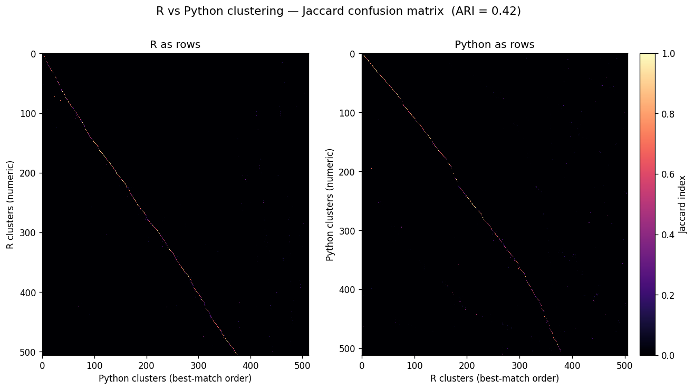
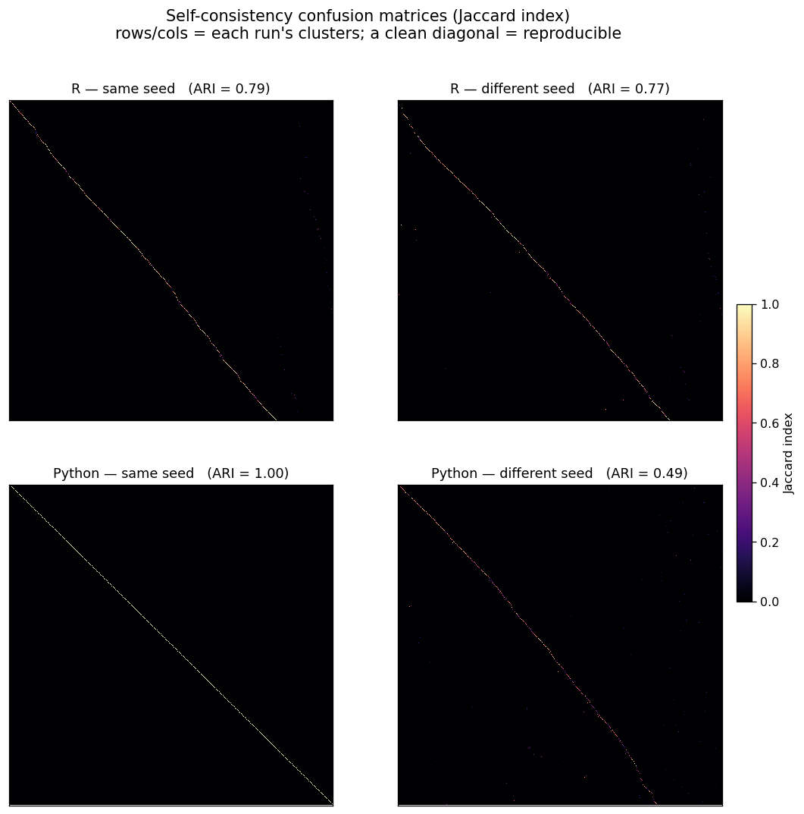

# R vs Python clustering — EARLY (partial) alignment & reproducibility ceiling

Early cross-pipeline comparison of iterative HiCAT clustering on the **same 194,221 spinal-cord neurons**
and the **same 32-dim scVI embedding**, at the **pre-final-merge** stage (`clusters_before_final_merge`;
R's `iter_clust_big` has no global final-merge step). These results reflect only **partial** alignment —
see the table below. For the fully-aligned result see
[`4_full_recursive_comparison.md`](4_full_recursive_comparison.md); full change log in [`changes.md`](changes.md).

## 1. Alignment state — what's applied vs not

At this snapshot the Python side is **stock `transcriptomic_clustering`** (stock *algorithm*) run with
*aligned parameters*, and **R was modified for a fair comparison** (embedding path, cap removal,
always-recurse). The algorithm-level changes that later closed most of the gap are **not** in yet.

| Applied here — R modifications + aligned parameters (see `changes.md`) | **NOT yet applied** (the changes that closed most of the gap) |
|---|---|
| **Shared scVI embedding** — both cluster on the latent at every level (R's internal HVG→PCA block removed) | **SNN Jaccard graph** (`jaccard_snn`) — used a plain KNN graph |
| **R: cluster-count cap removed** — `max.cl=Inf` on the Louvain/Leiden path (stock R collapsed Louvain output to `2·n_dims+1`); now uncapped like Python | **Fixed Annoy seed** (`annoy_seed=1`) — Annoy was reseeded per run |
| **Edge pruning aligned** — Jaccard `prune=0.05` gated at >50k cells, **both** sides (Python modified to replicate R `jaccard_big`; §5d) | **`annoy_trees`** left at the default (~17 for 194k cells) — **not** raised to R's fixed **50** (§5e) |
| Aligned clustering params: **k=15**, Louvain **resolution=1**, **Annoy-Euclidean** KNN backend/metric | **Leiden** (`vtraag`) — used python-louvain (Blondel) |
| **ln-converted DE thresholds** (`lfc`/`low` ×ln2, `padj` 0.01, `min.cells` 10) + **DE-score cap = 20**/gene | **Aligned DE-merge** (#1 per-round, #3 num<min_genes, #4 Euclidean candidates) — stock merge |
| **`max.cl.size` aligned** — per-cluster *cell* cap off, both uncapped (`Inf` in R / `None` in Python, §5c) | |

> **Note on the R runs here:** they are **pre-fix**, so R is not yet reproducible even at a fixed seed
> (§2 same-seed ARI 0.79). **The only fix required was to R's seeding — nothing algorithmic:** stock
> `sample_cells()` calls `set.seed(NULL)` internally, reseeding from the clock/PID on every merge; the fix
> overrides `sample_cells` to seed only when a seed is explicitly supplied, plus one top-level `set.seed()`.
> That alone makes R deterministic at a fixed seed (ARI 1.00) — Annoy KNN and Louvain were already
> reproducible (Annoy was a red herring). Details in [`2_self_consistency.md`](2_self_consistency.md); the
> 506-cluster tables here were never regenerated with the fix.

## 2. Cross-pipeline comparison (R ↔ Python)

| Metric | Value | Reading |
|---|---|---|
| Clusters (R / Python) | 506 / 512 | near-identical granularity |
| **ARI** | **0.42** | moderate; exact fine-boundary labels differ |
| **NMI** | **0.82** | high; strong shared structure |
| best-match Jaccard, median (all 506 R clusters) | 0.55 | |
| reciprocal best-match Jaccard, median (370 mutual pairs) | 0.68 | |
| cells inside a reciprocal pair's overlap | 64% | |

### Jaccard confusion matrix

Both orientations side by side. In each panel, rows = one pipeline's clusters (numeric order), columns =
the other's ordered by each row's best match, color = Jaccard `J = |A∩B| / |A∪B|`. **Left:** R as rows.
**Right:** Python as rows. ARI = 0.42 (symmetric).

**The diagonal is shifted/broken because the mapping is many-to-one, not 1:1:**

- Only **376 / 512** Python clusters are ever an R cluster's best match → **136 (27%) never a best match**.
- **89 Python clusters are the best match for 2–9 R clusters** (absorbing 219 R clusters = 43% of rows).
  When *k* R rows point to one Python column, only one sits on the diagonal; the rest fall off.
- Counts are nearly equal (506 vs 512), so where R splits a Python cluster finer, Python splits finer
  elsewhere — the two **carve the cells along partly different boundaries** (cross-cutting), not a clean
  hierarchy. That **both** panels are off-diagonal confirms the mismatch is cross-cutting, not a one-way
  refinement.

## 3. Self-consistency — the reproducibility ceiling

Each pipeline rerun with a changed seed (diff-seed) and with the seed held fixed (same-seed). Comparing a
pipeline **to itself** bounds how much cross-pipeline agreement is even possible.

| Comparison | Isolates | Clusters | ARI | Recip-Jaccard (median) | Cell coverage |
|---|---|---|---|---|---|
| **R** diff-seed (run1 vs run2) | seed sensitivity | 506 vs 478 | **0.77** | 0.85 | 80% |
| **Python** diff-seed (run2 vs seed7) | seed sensitivity | 512 vs 501 | **0.49** | 0.66 | 66% |
| **R** same-seed (run2 vs run3) | fixed-seed determinism | 478 vs 485 | **0.79** | 0.90 | 81% |
| **Python** same-seed (run2 vs 2024b) | fixed-seed determinism | 512 vs 512 | **1.00** | 1.00 | 100% |
| **R ↔ Python** (cross, reference) | implementation diff | 506 vs 512 | 0.42 | 0.68 | 64% |

**The two pipelines had opposite reproducibility profiles:**
- **Python** — same-seed **1.00**, diff-seed **0.49**: fully deterministic given a seed, but very
  seed-sensitive (variability is 100% seed-driven).
- **R (as-tested, pre-fix)** — same-seed **0.79**, diff-seed **0.77**: *not* deterministic even at a fixed
  seed. Root cause was `sample_cells()`'s internal `set.seed(NULL)` — traced and fixed; see
  [`2_self_consistency.md`](2_self_consistency.md). (After the fix R is same-seed 1.00.)

**Python same-seed** is a clean diagonal (1.00); **Python diff-seed** is heavily smeared (0.49). **R** looks
about the same in *both* columns (0.79 ≈ 0.77) — pre-fix it did not reproduce itself even at a fixed seed.
Diagonal-ness ordering: Python-same-seed (1.00) → R (0.77–0.79) → Python-diff-seed (0.49) → R↔Python cross
(0.42, heaviest).

## 4. What this means

**Make each method self-consistent *first*, then align R vs Python.** The cross-pipeline ARI (0.42) is
barely below Python's own diff-seed floor (0.49) — R and Python disagree about as much as Python disagrees
with *itself* across seeds. So at this stage the gap is **dominated by each pipeline's intrinsic
stochasticity, not a genuine R-vs-Python difference**, and chasing a clean cross-pipeline diagonal is
premature while Python self-consistency sits at 0.49 and R can't reproduce itself at a fixed seed.

The right order of operations, which the rest of the reports follow:

1. **Fix same-seed determinism.** R's `sample_cells` `set.seed(NULL)` → override (R now 1.00). Python was
   already 1.00. → [`2_self_consistency.md`](2_self_consistency.md)
2. **Raise diff-seed self-consistency of each method.** For Python: `annoy_trees=50` + fixed `annoy_seed`
   + Leiden lifted it 0.51 → 0.91, matching R's 0.915. → [`2_self_consistency.md`](2_self_consistency.md),
   [`3_firststep_comparison.md`](3_firststep_comparison.md)
3. **Only then align the two.** With both self-stable, the *code* changes (SNN graph, DE-merge alignment)
   raised cross-agreement 0.23 → 0.88 (first-step) and 0.83 (full recursive). →
   [`three_way_comparison.md`](three_way_comparison.md), [`4_full_recursive_comparison.md`](4_full_recursive_comparison.md)

Self-consistency and cross-agreement are **independent axes**: fixing one does not fix the other, and a
cross comparison is only meaningful once both pipelines are self-stable.

---

## Appendix A — how the metrics are computed

Both metrics take the **same input**: two per-cell cluster-label vectors over the **identical 194,221
cells**, aligned by barcode.

**Reciprocal Jaccard** — per cluster *pair*. For A-cluster *i*, B-cluster *j*,
`J = |A_i ∩ B_j| / (|A_i| + |B_j| − |A_i ∩ B_j|)`. Keep mutual best matches (A_i's top overlap is B_j
**and** vice-versa); report the median. Per-cluster, unweighted, excludes non-matched clusters (optimistic).

**ARI (Adjusted Rand Index)** — global, pair-counting, chance-corrected over all `C(N,2)` ≈ 1.89×10¹⁰ cell
pairs. It credits only pairs **together in both** partitions beyond chance. Worked example (Python 512 vs
seed-7 501): together-in-both = 208.8M, together-in-A = 309.6M, together-in-B = 517.8M, expected = 8.5M,
max = 413.7M → **ARI = 0.494**. The raw Rand index is 0.978 — meaningless here (with ~500 clusters almost
every pair is "apart in both", so chance agreement is huge; ARI removes it). This is why ARI reads lower
than reciprocal-Jaccard: it is a global chance-corrected accounting unforgiving of boundary shuffling,
while reciprocal Jaccard scores only matched clusters' overlaps.

## Appendix B — why they don't match (residual sources, at this stage)

- **Different Louvain libraries** — igraph `cluster_louvain` (R) vs `python-louvain`/"taynaud" (Python).
- **Different DE engines** — `de_pair_fast_limma`/`simple_ebayes` (R) vs `de_pairs_ebayes` (Python).
- **Approximate KNN (Annoy)** — randomized forests, per-run reseeded here; graphs not identical.
- **Stochasticity** — Louvain init + random cell sampling; seed sensitivity is large at 500 clusters.

## Appendix C — provenance / files

- R partitions: `clustering_bigcat/r_clusters.csv` (run1, 506), `out_r2/…` (478), `out_r3/…` (485).
- Python partitions: `clusterinig_hicatMPI/out/clusters_before_final_merge.csv` (512),
  `selfconsist/py_seed7/…` (501), `selfconsist/py_seed2024b/…`.
- Matrices/plots: `images/r_py_confusion_sidebyside.png`, `images/selfconsist_grid.png`.
