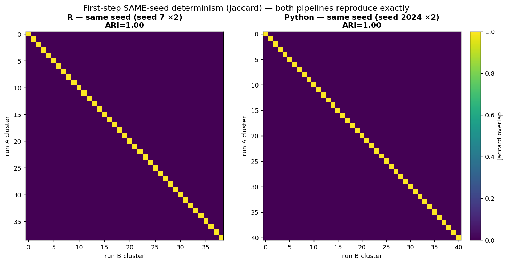
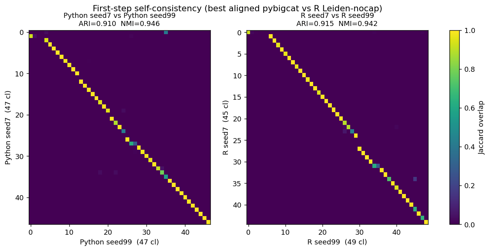

# Self-consistency: what makes each pipeline stable across seeds

**Self-consistency** = how much a pipeline's clusters change when only the random seed changes. It is a
*within-pipeline* property, separate from cross-pipeline agreement (R vs Python) — a pipeline must be
self-consistent before a cross comparison is meaningful. Measured on the first clustering step (194,221
cells / 32-dim scVI, top-level `onestep`, no recursion).

Two quantities, measured separately:
- **Same-seed** (seed X twice): a **determinism** check — should be 1.00.
- **Different-seed** (e.g. seed 7 vs 99): the real **stability** metric ("self-consistency" below unless
  stated). Metric = ARI.

This report treats **R and Python separately** — what each needed to become self-consistent, and its
results — then compares the two.

---

# Part 1 — R (`scrattch.bigcat`)

## What made R self-consistent

- **Same-seed determinism** required one fix. Stock R was **not** reproducible even at a fixed seed
  (same-seed ARI ~0.79) because **`sample_cells()`** re-seeds the RNG **inside** the per-cluster sampling
  loop:

  ```r
  sample_cells <- function(cl, sample.size, weights = NULL, seed = NULL) {
    ...  set.seed(seed)               # seed defaults to NULL
         sampled <- sample(cells, to.sample)
  }
  ```

  `merge_cl_big` → `get_cl_stats_big` call it as `sample_cells(cl, max.cl.size)` **without a seed**, so
  `set.seed(NULL)` runs — which in R **re-initializes the RNG from the clock/PID**. Every merge draws a
  *different* ≤300-cell subsample → different DE stats → different merges → a different partition, even
  under the same top-level `set.seed(7)`. Verified: `sample_cells(cl,100)` differs across two `set.seed(7)`
  calls, but `sample_cells(cl,100, seed=7)` is identical. Code unchanged on current GitHub `master`, so
  it's a **fixable quirk**, not hardware noise.
  **Fix (`sample_cells_fixed.R`):** call `set.seed()` only when a seed is explicitly supplied; `clust.R`
  installs the override + one top-level `set.seed(2024)` → same-seed ARI **1.00** (39 vs 39 top-level).
  **This same quirk reaches post-clustering QC.** `get_cl_stats_big` also calls `sample_cells(cl,
  max.cl.size)` seedless, so `de_all_pairs` is non-reproducible too: two R runs on an identical
  clustering disagree on 77 % of pairs, and disagree with each other *more* than either disagrees with
  Python — quantified in [6_de_all_pairs_R_vs_python.md](6_de_all_pairs_R_vs_python.md).

- **Different-seed stability** needed **no change** — R was already stable by construction: its Annoy
  (`BiocNeighbors::buildAnnoy`) uses a **fixed internal seed that ignores R's `set.seed()`**, so the KNN
  graph is seed-invariant, and it uses Leiden. R effectively always had "fixed Annoy seed + Leiden".

## R results (first-step, 194k cells / 32-dim scVI)

| Comparison | Clusters | ARI | NMI |
|---|---|---|---|
| **same-seed** (7 vs 7) | 39 vs 39 | **1.00** | 1.00 |
| **different-seed**, Louvain (7 vs 99) | 39 vs 44 | **0.91** | 0.95 |
| **different-seed**, Leiden (7 vs 99) | 48 vs 50 | **0.93** | 0.94 |
| **different-seed**, Leiden-nocap "best" reference (7 vs 99) | 45 vs 49 | **0.915** | 0.942 |

*(The earlier full-pipeline R same-seed numbers of 0.77–0.79 predate the `sample_cells` fix.)*

> **These are first-step numbers, and the seed pair matters.** At **full recursive** depth and a
> different seed pair (2024 vs 7) R's self-consistency is **0.814**, not 0.915 — and the drop is mostly
> the seed pair, not the recursion: seed 2024 yields 59 top-level clusters where seed 7 yields 45, while
> seeds 7 and 99 happen to agree closely (45 vs 49). Decomposition in
> [9_knn_backends.md](9_knn_backends.md#why-this-r-number-0814-differs-from-the-0915-in-report-2).

---

# Part 2 — Python (`transcriptomic_clustering` → `pybigcat`)

## What made Python self-consistent

- **Same-seed determinism** was already there — Annoy, Louvain/Leiden are all seeded, so a fixed seed
  reproduces bit-for-bit (same-seed ARI 1.00) with no fix needed.

- **Different-seed stability** was the problem (originally ARI **0.51**), and its **root cause** was an
  **unstable approximate-KNN graph**: with few Annoy trees the random-projection forest returns
  seed-sensitive neighbors, and **Louvain amplified** that graph noise into large label reshuffles. Three
  stacking levers fix it (each partly redundant with the others):
  1. **More Annoy trees** (17 → 50) — a larger forest recovers nearly the same neighbors regardless of
     seed, stabilizing the graph.
  2. **Fixing the Annoy seed** (`annoy_seed=1`) — forces the *identical* graph across seeds.
  3. **Leiden instead of Louvain** — robust enough that residual graph noise doesn't reshuffle labels.

  **Key finding — fixing the Annoy seed is the top lever *only under Louvain*:**

  | Community detection | varying Annoy | fixed Annoy | Δ from fixing seed |
  |---|---|---|---|
  | **Louvain** (50 trees) | 0.57 | 0.77 | **+0.20** (large) |
  | **Leiden** (50 trees) | 0.869 | 0.910 | **+0.04** (small) |

  Under Leiden + 50 trees the graph is already stable, so the fixed seed adds little — but it's kept
  anyway (guarantees an identical graph at ~zero cost).

## Python results — different-seed self-consistency as each lever is added (first-step)

| Config | Annoy trees | Annoy seed | Community | Graph | Same-seed | **Diff-seed** |
|---|---|---|---|---|---|---|
| original (stock) | ~17 (`log2 N`) | varying | Louvain | KNN-edge | 1.00 | **0.51** |
| + more trees | 50 | varying | Louvain | KNN-edge | 1.00 | 0.57 |
| + fixed Annoy seed | 50 | fixed | Louvain | KNN-edge | 1.00 | 0.77 |
| + Leiden | 50 | fixed | Leiden | KNN-edge | 1.00 | 0.84 |
| **+ SNN graph (`pybigcat`)** | 50 | fixed | Leiden | **SNN** | 1.00 | **0.910** |

> **Note:** this is a *sequential* progression, so each row's Δ is **order-dependent** — the levers are
> partly redundant (all address the same unstable approximate-KNN graph). The win comes **mostly from
> `annoy_trees=50` + Leiden**, not from fixing the seed. More trees shows only +0.06 here because it was
> applied under a *varying* seed + Louvain; its real role is stabilizing the graph so the fixed-seed lever
> becomes nearly redundant (fixed seed adds only ~0.04 under Leiden — see the Key finding 2×2 above for the
> isolated effects).

`annoy_trees` is a real parameter: default `None` → `max(1, int(log2(n_cells)))` ≈ **17** for 194k cells
(`clustering.py:357–358`); the aligned config overrides it to a fixed **50**
(`cluster_louvain_kwargs={'annoy_trees': 50, 'annoy_seed': 1, 'louvain_method': 'vtraag', ...}`).

---

# Both — final self-consistency (they now match)

| Pipeline | Same-seed | Different-seed |
|---|---|---|
| **R** (`scrattch.bigcat`, Leiden) | 1.00 | **0.915** |
| **Python** (`pybigcat`, SNN + fixed-Annoy + Leiden) | 1.00 | **0.910** |

Python went from 0.51 → **0.910**, essentially matching R's 0.915. Two figures: first the **same-seed
determinism** check (each pipeline run twice at the same seed), then the **different-seed self-consistency**
at the best-aligned config.





**Same-seed** (top) is a clean diagonal for both (determinism, ARI 1.00); **different-seed** (bottom) is
now similarly tight for both — R **0.915** and Python **0.910**. (The stale Python 0.51 different-seed
panel from the stock config has been removed — that config is only the *starting point* of the progression
table above.)

## Takeaways

1. **R:** only the `sample_cells` same-seed fix was needed; different-seed stability came free (fixed
   internal Annoy seed + Leiden).
2. **Python:** the win comes mostly from **`annoy_trees=50` + Leiden** (stable KNN + robust community
   detection); the fixed Annoy seed adds only ~0.04 under Leiden but is kept for guaranteed graph identity.
3. **Self-consistency ≠ cross-agreement with R.** These levers made Python self-stable (0.51 → 0.91,
   matching R), but the *cross* R↔Python agreement (0.23 → 0.88) required the actual code changes (SNN
   graph + DE-merge alignment) — independent axes. See `3_firststep_comparison.md`, `three_way_comparison.md`,
   `changes.md`.

## Provenance
- First-step self-consistency + levers: `3_firststep_comparison.md` runners
  (`firststep/_run_firststep_{R,py,py_trees50,py_fixedannoy,py_leiden,py_best}.*`); jobs `fs_R` 23270113,
  `fs_Py` 23270114, `fs_PyBest` 23273888/23275452.
- Partitions: `firststep/firststep_{R,Py}_*_s{7,99}.csv`; three-way `firststep/firststep_3way_stock_s{7,99}.csv`.
- Figures: `images/firststep_selfconsist_grid.png`, `images/firststep_best_selfconsist.png`.
- `annoy_trees` default: `tool/pybigcat/pybigcat/clustering.py:357–358`.
