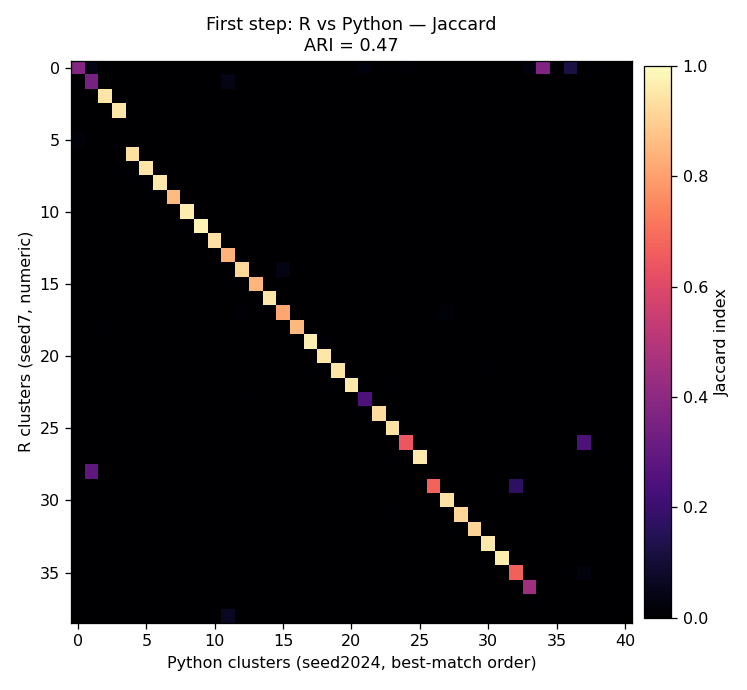
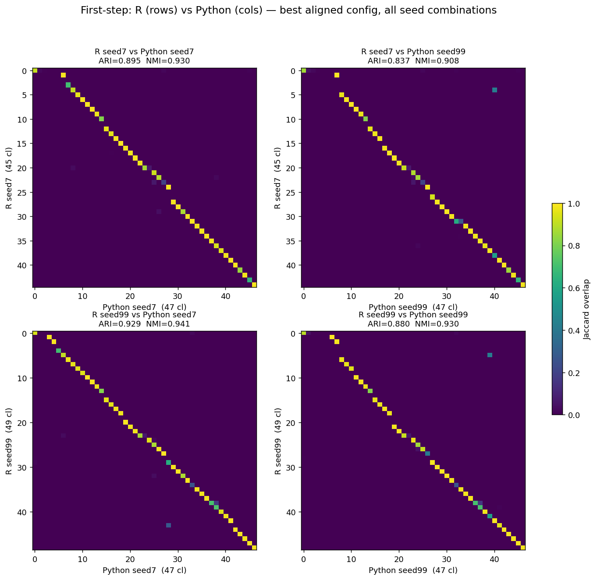

# First-step clustering — R vs Python cross-pipeline comparison

How concordant the two pipelines are at a single clustering step — the top-level `onestep`
(HVG-free, embedding-based Louvain/Leiden + one DE-merge), **no iterative recursion**.

- **R:** `onestep_clust_big(rd.dat=latent, de.score.th=300, …)` — top level, reproducibility-fixed `sample_cells`.
- **Python:** `onestep_clust(adata, kwargs, seed)` — top level, aligned config (`score_thresh=300`, matched thresholds).
- Same 194,221 cells, same 32-dim scVI embedding. Metrics: ARI, NMI, reciprocal-Jaccard median, cell coverage.

> **Self-consistency (each pipeline across seeds) lives in [`2_self_consistency.md`](2_self_consistency.md).**
> Both pipelines are deterministic at a fixed seed (same-seed ARI 1.00) and reach diff-seed ~0.91; this
> report is the **cross-pipeline** (R↔Python) comparison. The two are independent axes.

---

## 1. Early cross agreement (stock Python, Louvain, KNN-edge graph)

| Comparison | Clusters | ARI | NMI | Reciprocal Jaccard (median) | Cell coverage |
|---|---|---|---|---|---|
| **R vs Python** (7 vs 2024) | 39 vs 41 | **0.47** | 0.82 | **0.94** | 70% |

- **The first step agrees much better across pipelines than the full pipeline does.** R↔Python
  reciprocal-Jaccard is **0.94** here vs **0.68** for the full recursive pipeline — matched top-level
  clusters overlap ~94%. The R↔Python divergence is therefore **accumulated through the recursion**, not
  created at the first step. (ARI stays modest at 0.47 because ARI is harsh at ~40 clusters and is dragged
  down by many-to-one boundary structure the reciprocal metric is robust to.)
- **The cross gap ≈ Python's own seed sensitivity.** R↔Python ARI (0.47) sits right at Python's own
  different-seed floor (0.51, see `2_self_consistency.md`) — most of the early difference is Python's seed
  sensitivity, not a genuine algorithmic divergence.

---

## 2. Fully-aligned config (`pybigcat`): SNN graph + aligned merge → cross ARI 0.52 → ~0.88

The definitive first-step comparison uses **`pybigcat`** with *all* alignment changes stacked. What
carried over from the early run (§1) versus what this config adds:

| What's applied previously (early / stock-Python config) | What's new (fully-aligned `pybigcat` config) |
|---|---|
| **Shared scVI embedding** — both cluster on the latent at every level (R's internal HVG→PCA block removed) | **SNN Jaccard graph** (`jaccard_snn`) — replaces the plain KNN-edge graph (0.90 edge overlap with R `jaccard_big`; §7) |
| **R: cluster-count cap removed** — `max.cl=Inf` on the Louvain/Leiden path; uncapped like Python | **Fixed Annoy seed** (`annoy_seed=1`) — seed-invariant KNN graph (was reseeded per run) |
| **Edge pruning aligned** — Jaccard `prune=0.05` gated at >50k cells, both sides (§5d) | **`annoy_trees` raised to 50** (R's fixed value) — was the default ~17 for 194k cells (§5e) |
| Aligned clustering params: **k=15**, Louvain **resolution=1**, **Annoy-Euclidean** KNN backend/metric | **Leiden** (`vtraag` / igraph `cluster_leiden`) — replaces python-louvain (Blondel) |
| **ln-converted DE thresholds** (`lfc`/`low` ×ln2, `padj` 0.01, `min.cells` 10) + **DE-score cap = 20**/gene | **Aligned DE-merge** (#1 per-round `best + extras<th/2`, #3 `num<min_genes`, #4 Euclidean candidates — merge-on-shared ARI 0.95; §7) |
| **`max.cl.size` aligned** — per-cluster *cell* cap off, both uncapped (`Inf` / `None`, §5c) | |

R side = the Leiden-nocap reference (`firststep_R_leiden_nocap_s{7,99}`, unchanged pristine R).
Both run at seeds 7 and 99. Top level only, 194,221 cells / 32-dim scVI.

| Comparison | Clusters | ARI | NMI |
|---|---|---|---|
| **R7 vs Py7** | 45 vs 47 | **0.895** | 0.930 |
| **R7 vs Py99** | 45 vs 47 | 0.837 | 0.908 |
| **R99 vs Py7** | 49 vs 47 | **0.929** | 0.941 |
| **R99 vs Py99** | 49 vs 47 | 0.880 | 0.930 |
| *Python self* (7 vs 99), for reference | 47 vs 47 | 0.910 | 0.946 |
| *R self* (7 vs 99), for reference | 45 vs 49 | 0.915 | 0.942 |

*(Self rows are the self-consistency ceiling — detail in [`2_self_consistency.md`](2_self_consistency.md).)*

### Findings
1. **R↔Python cross agreement jumped from 0.52 → ~0.88** (avg of the four cross ARIs, range 0.84–0.93).
   Matching the **graph construction** (SNN, +0.90 edge overlap) and the **DE-merge** (control-flow
   #1/#3 + Euclidean candidates #4) is what closed the first-step gap that all the earlier
   seed/Annoy/Leiden self-consistency work (topping out at 0.52 cross) could not.
2. **Cluster counts converged:** Python 47/47, R 45/49 — Python now lands squarely inside R's own
   seed-to-seed range.
3. **The cross now approaches the within-pipeline self-consistency ceiling** (~0.91). The best cross
   (R99 vs Py7 = 0.929) actually exceeds each pipeline's own diff-seed self-consistency — i.e. the
   residual R↔Python difference is now on the order of ordinary seed noise, not a systematic algorithmic
   divergence. The remaining gap is the irreducible different-Annoy-forest + different-Leiden-implementation
   effect (cannot reach 1.0 without exact KNN + identical community solver).

### Progression of the first-step R↔Python cross ARI
| Config | Cross ARI |
|---|---|
| Louvain, varying Annoy (orig) | 0.47 |
| Leiden + fixed Annoy (KNN-edge graph, old merge) | 0.52 |
| **+ SNN graph + aligned merge (this section)** | **~0.88** |

### Implementation caveat
Python Leiden = `leidenalg` (vtraag `ModularityVertexPartition`); **R Leiden = igraph `cluster_leiden`**
(R's shipped `leidenAlg::leiden.community` is broken in this container — leidenAlg 1.0.5 vs current igraph
ABI mismatch — so `knn_jaccard_clust` was overridden to igraph's native `cluster_leiden`,
`clustering_bigcat/knn_jaccard_clust_leiden_fix.R`). The cross is therefore still
different-graph + different-Leiden-impl and cannot reach 1.0.

## Overall takeaway
With graph construction and the DE-merge aligned, the two pipelines agree at the first step at
**ARI ≈ 0.88** — essentially the seed-noise ceiling. The large disagreements seen earlier were dominated
by two concrete, fixable differences (KNN-edge vs SNN graph; correlation vs Euclidean merge candidates),
not a fundamental algorithmic divergence, and the R↔Python divergence in the *full* pipeline accumulates
through the recursion. A cell-perfect match remains out of reach (different Annoy forests + different
Leiden implementations). Self-consistency of each pipeline: [`2_self_consistency.md`](2_self_consistency.md).

## Provenance
- Early cross: R `firststep/firststep_R_s7a.csv` (job `fs_R` 23270113), Python `firststep/firststep_Py_s2024a.csv`
  (job `fs_Py` 23270114); figure `images/firststep_R_vs_Py.png`.
- Fully-aligned: Python `firststep/firststep_Py_best_s{7,99}.csv` (`_run_firststep_py_best.py`, `pybigcat`,
  jobs `fs_PyBest` 23273888/23275452; ~2 h/seed — SNN build + Leiden + conservative merge, pre-numpy-merge),
  R `firststep/firststep_R_leiden_nocap_s{7,99}.csv`; plot `firststep/_plot_firststep_best.py`,
  figure `images/firststep_best_cross.png`.
