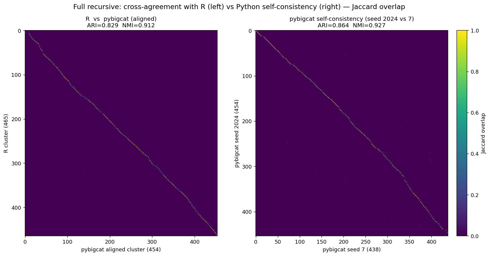
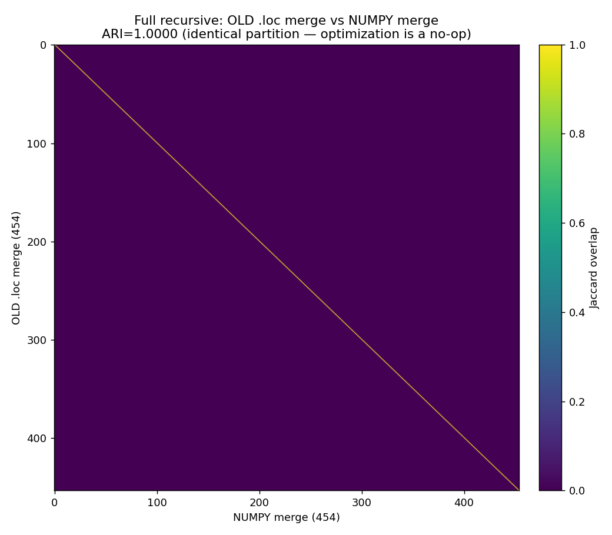

# Full recursive clustering: pybigcat vs scrattch.bigcat (R)

End-to-end **whole-pipeline** comparison on the spinal-cord neuron subset
(194,221 cells × 17,277 genes, scVI 32-d latent). All three runs use the same
clustering parameters (k=15 KNN, Annoy seed=1, SNN/`jaccard_snn` graph, Leiden
resolution 1.0, split_size=10, top/recursive DE score thresholds 300/150).
The two pybigcat runs differ **only** in `merge_mode`.

## Results (clusters before final merge)

Agreement with R and end-to-end runtime, together:

| Run | Clusters | ARI vs R | NMI vs R | Wall-clock |
|---|---:|---:|---:|---|
| **R (scrattch.bigcat, Leiden)** | 465 | — | — | **2 h 37 m** |
| pybigcat — `aligned` merge (before numpy fix) | 454 | 0.829 | 0.912 | 2 h 33 m (~same as R) |
| pybigcat — `fast` merge | 481 | 0.761 | 0.902 | 46 min (3.4× faster) |
| **pybigcat — `aligned` merge** (numpy fix) | **454** | **0.829** | **0.912** | **18.9 min** (~8× faster than R) |

*(The two aligned rows are the **same result** — 454 clusters, bit-identical — differing only in the
merge implementation's speed; details in [Runtime analysis](#runtime-analysis).)*

- The **aligned merge is closest to R** on both cluster count (454 vs 465; fast over-splits to 481) and
  partition agreement (ARI 0.829 vs 0.761) — and, after the numpy-merge fix, also **~8× faster than R**.
- `aligned` vs `fast` agreement: ARI = 0.795.
- Whole-pipeline ARI is lower than the isolated shared-partition merge test (0.954 aligned / 0.906 fast)
  because small per-level KNN/graph/Leiden differences compound across the recursive tree — every
  recursion level's nondeterminism accumulates into the final partition.

## Confusion heatmaps

Jaccard overlap; columns reordered so each sits under its best-matching row, putting the 1:1
correspondence on the diagonal (a bright diagonal cell = a clean one-to-one mapping).
**Left — cross-agreement with R** (R rows vs pybigcat aligned cols, ARI 0.829).
**Right — Python self-consistency** (aligned seed 2024 vs seed 7, ARI 0.864).

- **Self-consistency (0.864) is higher than cross-agreement with R (0.829)** — the pipeline is more
  reproducible with itself than it agrees with R, as expected. Both diagonals are tight.
- The self-consistency isn't a perfect 1.0 because the **Annoy KNN graph is seed-invariant**
  (`annoy_seed=1` fixed) but **Leiden's community-detection init still uses `random_seed`**, so the two
  seeds carve slightly different fine boundaries (454 vs 438 clusters). A *same*-seed rerun is
  bit-identical (ARI 1.0); this cross-seed 0.864 is the seed-sensitivity floor.
- The aligned-vs-fast confusion (both against R) is in `images/heatmap_full_side_by_side.png`.

## `aligned` vs `fast` merge — what differs

Both modes use the same DE test, the same thresholds, and the same **#4 Euclidean candidate-pair
metric** (the change that recovered most of the alignment with R). They differ only in the merge
**control flow**:

| | **`aligned`** (default) | **`fast`** |
|---|---|---|
| Candidate re-scan each round | **all** clusters' k-nearest (mirrors R `get_knn_pairs`) | only the just-merged clusters' neighbors (after round 1) |
| How many merges per round | **one** — the single lowest-score pair, plus extras only if `score < score_th/2` | **every** non-conflicting candidate with `score < score_th` |
| Rounds to converge | many (≈ one merge/round) | few |
| Fidelity to R | highest (ARI 0.954 on the isolated merge test; matches R's cluster count) | slightly lower (0.906; tends to over-split) |
| Speed | slow before the numpy fix; now ~1 min | ~5× fewer rounds |

In short: `aligned` is R-faithful — it re-evaluates the whole neighborhood every round and commits one
conservative merge at a time, exactly like `merge_cl_big`. `fast` trades a little fidelity for far fewer
rounds by merging every acceptable pair at once and only re-examining the affected neighborhoods after.

## Final merge — R vs Python (same latent input)

The results above are the *pre-final-merge* partitions. Both pipelines then apply a global DE-based final
merge (R `merge_cl_big`; Python `final_merge` → the same aligned `merge_clusters` algorithm). To compare
the final-merge step head-to-head, both were run on the **same latent as `rd.dat`** (`space='latent'` in
Python), `de.score.th = 100`, `max.cl.size = Inf`, seed 2024 — so only the *implementation* differs, not
the reduced space.

| | Pre-final-merge | Post-final-merge | merged |
|---|---:|---:|---:|
| **R (scrattch.bigcat `merge_cl_big`)** | 465 | **438** | 27 |
| **Python (tc `final_merge`)** | 454 | **428** | 26 |
| **R↔Python ARI** | **0.829** | **0.828** | |
| **R↔Python NMI** | 0.912 | 0.912 | |

- The final merge is a **light, symmetric cleanup**: both pipelines merge ~5–6 % of clusters (R 27, Py 26),
  landing at 438 vs 428.
- **Cross-pipeline agreement is essentially unchanged** (0.829 → 0.828) — the final merge neither closes
  nor widens the R↔Python gap; both diagonals stay equally tight.
- Caveat: R's *native* final merge (`merge.R`) uses **marker-gene** space for `rd.dat`, not the latent —
  here both were forced onto the latent for an apples-to-apples implementation comparison. tc's
  `final_merge` now supports both (`space='markers'` / `'latent'`).
- Runs: `final_merge_compare/_final_merge_{R.R,py.py}` (R job 25050682, Py job 25053435).

### Isolating the final-merge step (both on the *same* py454 input)

The comparison above still mixes two effects — the recursive-clustering difference (465 vs 454) *and* the
final-merge implementation. To isolate the **final-merge step alone**, both merges were run on the
**identical py454 partition** (Python's 454-cluster recursive result), so any output difference is purely
R `merge_cl_big` vs tc `final_merge`.

| From the same 454 input | Result | vs the 454 input |
|---|---|---|
| **R** `merge_cl_big` | 454 → **425** (merged 29) | ARI 0.998 |
| **Python** `final_merge` | 454 → **428** (merged 26) | ARI 0.998 |
| **R-final vs Python-final** | | **ARI 0.997, NMI 0.999** |

**Given the same input, the two final-merge implementations are nearly identical (ARI 0.997)** — each only
merges ~5–6 % of clusters, barely perturbing the partition. Contrast the left panel (isolated final merge,
**0.997**) with the right (each pipeline on its own recursion, **0.828**): **the entire R↔Python gap is
accumulated in the recursive clustering, not the final merge.** The final-merge step is effectively a
no-op difference between the two pipelines.

- Run: `final_merge_compare/_final_merge_R_on_py454.R` (R job 25054163) vs the existing Python `final_merge` on py454.

## Runtime analysis

The headline wall-clock is in the [Results](#results-clusters-before-final-merge) table above
(R 2 h 37 m · aligned **18.9 min** · fast 46 min). This section explains where the time goes and how
the aligned run dropped from 2 h 33 m to ~19 min.

Before the numpy-merge fix the aligned run took **2 h 33 m** — matching R's runtime because the aligned
merge faithfully reproduces R's algorithm (`merge_cl_big`, `max.cl.size=Inf`, DE over all cells); the
merge was never doing more real work than R, just paying pandas overhead. R's merge is interleaved
recursively (jaccard→Leiden→`merge_cl_big` at every level), so it has no isolable "merge step" number.
With the merge now trivial, pybigcat's remaining cost is the **recursion** (~14 min: sub-clusters'
KNN/Leiden), not the merge.

### pybigcat top-level step breakdown (194,221 cells × 17,277 genes)

Profiled on one node (`_profile_toplevel.py`), running `cluster_louvain` once then
timing both merge modes on the identical raw clusters:

| Step | Time (before) | Time (after numpy merge) | Detail |
|---|---:|---:|---|
| `latent_project` | 0.0 s | 0.0 s | attach scVI 32-d embedding |
| **KNN + graph + Leiden** (`cluster_louvain`) | 55.9 s | 91.7 s | → **91 raw clusters** (diff = node variance) |
| ↳ Annoy KNN build + query | 32.6 s | | |
| ↳ Leiden (vtraag) | 22.7 s | | |
| **merge — fast** | **1,605 s (26.8 min)** | **78 s** | 91 → 57 · **~21×** |
| **merge — aligned** | **8,918 s (2 h 29 m)** | **62 s** | 91 → 47 · **~144×** |
| recursion (all sub-clusters) | ~14 min | (numpy too, faster) | many small merges |

Originally the clustering was trivial (56 s, only 91 raw clusters) and **the entire
top-level cost was the merge** — aligned 2 h 33 m ≈ 56 s + 2 h 29 m merge. After the
numpy-merge fix (below) both merges finish in ~1 min, so the whole top-level pass
(clustering + aligned merge) is now **under 3 minutes**.

### Where the merge time goes (cProfile of the real merge)

`_profile_merge.py` cProfiled the fast merge (1,602 s):

| Cost | Time | Cause |
|---|---:|---|
| `numpy.array` construction | **1,191 s (74 %)** | pandas `.loc[row]=` on wide (×17,277) mean/var/present DataFrames — each row-assignment re-introspects every column's dtype (`get_dtypes`), 69k+ times |
| `_thread.lock` (marker selection) | 223 s (14 %) | one-time parallel `de_all_pairs` at the end |
| pandas `get_dtypes` / setitem overhead | ~110 s | same `.loc`/`.drop` path |

**74 % of the merge was pandas bookkeeping, not DE computation.** The culprit was
`merge_cluster_means_vars` doing `cluster_means.loc[label_dest] = mean_comb` +
`.drop(label_source)` per merge on 17,277-column frames — *not* extra real work vs R
(R uses native matrices), just removable overhead.

### Fix (implemented): numpy-level merge updates
`merge_clusters_by_de` now holds the means/vars/present as **numpy arrays** with a
`label→row` map and combines rows arithmetically in place (small DataFrames rebuilt
only for the per-round DE call). Verified **bit-identical** to the old path —
assignments, means, variances, and present all Δ=0 across both merge modes and
multiple seeds. One subtlety was replicated exactly: the old variance formula's
`(mean2 − mean_comb)²` term was silently zero (a pandas view got overwritten before
use), so the numpy version drops that term to match.

**Measured result (isolated merge):** fast merge 1,605 s → **78 s (~21×)**; aligned
merge 8,918 s → **62 s (~144×)**. (Separately, R's usual default `max.cl.size=300`
subsamples cells for the DE test; the reference run used `Inf` for faithfulness.)

**End-to-end confirmation:** with the numpy merge the whole aligned pipeline ran in **18.9 min** (vs
2 h 33 m before, job 23303147). To prove the optimization changes nothing, the **old `.loc` merge was
re-run through the full recursive pipeline** (job 23305439, 2 h 53 m) and compared cell-for-cell to the
numpy run: **454 vs 454 clusters, ARI = 1.000, NMI = 1.000** — the two partitions are *identical*, not
just similar. So the ~8× speedup is a pure no-op, confirmed end-to-end (not only in unit tests).

The top-level pass now clears in ~4 min; the remaining ~14 min is the **recursion** (sub-clusters'
KNN/Leiden), now the dominant cost — the merge is trivial. **pybigcat aligned is now ~8× faster than R
(2 h 37 m) at the identical result.**

## Reproduce

- R: `clustering_bigcat/_run_full_R_leiden.R` → `full_R_leiden.csv` (job 23280208, 2 h 37 m)
- pybigcat aligned: `clusterinig_hicatMPI/submit_pipeline.sh` (`merge_mode='aligned'`) — job 23295466
  (2 h 33 m, pre merge-fix) and job 23303147 (**18.9 min, numpy merge**); both 454 clusters
- pybigcat fast: `clustering_hicatMPI_fast/submit_pipeline.sh` (`merge_mode='fast'`, job 23292020)
- pybigcat aligned seed 7 (self-consistency): `clustering_hicatMPI_seed7/submit_pipeline.sh`
  (`random_seed=7`, job 23304838, 16.7 min, 438 clusters) vs seed-2024 `clusters_numpy_454.csv`
- old-merge no-op check: hybrid old `.loc` merge full run (job 23305439, 2 h 53 m) →
  `clusters_oldmerge_454.csv` vs numpy `clusters_numpy_454.csv` → ARI 1.000
  (`images/heatmap_oldmerge_vs_numpymerge.png`)
- metrics + side-by-side heatmaps: `_make_full_heatmaps.py`
- top-level step timing: `_profile_toplevel.py`; merge cProfile: `_profile_merge.py`
