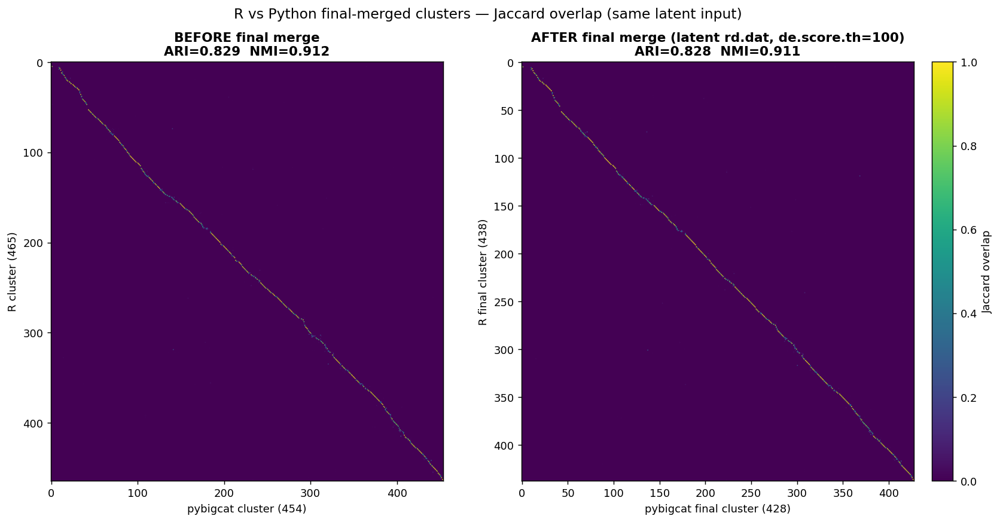
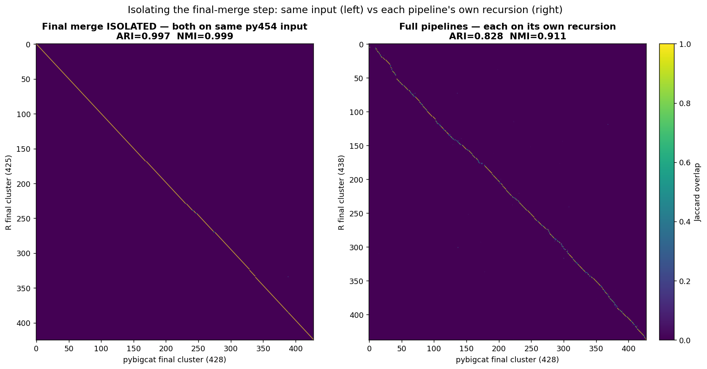

# Final merging — R `scrattch.bigcat` vs Python `transcriptomic_clustering`

The final merge is the global DE-based cleanup applied **after** recursive clustering: all clusters from
the whole tree are re-examined together and near-duplicates are merged. This report compares the two
implementations, isolates how much they differ, and identifies where the residual differences come from.

**Headline: any inconsistency here is not a property of the final merge — it is inherited from the merge
routine that R and Python each reuse for *every* clustering step, where Python selects merge candidates
with exact `scipy.cdist` and R with approximate annoy.** Given the same input the two implementations
agree at **ARI 0.997**, and the entire R↔Python gap is accumulated in the *recursive clustering*, not
here. Details in §6.

---

## 1. It is the same function as the per-step merge

Both pipelines reuse their per-step merge routine for the final merge — there is no separate algorithm:

| | per-step merge (inside each clustering level) | final merge |
|---|---|---|
| **R** | `onestep_clust_big` → `merge_cl_big` | `merge.R` → `merge_cl_big` |
| **Python** | `onestep_clust` → `merge_clusters` → `merge_clusters_by_de` | `final_merge` → `merge_clusters` → `merge_clusters_by_de` |

Because the per-step merge had already been aligned (Euclidean candidate metric, R-faithful control flow,
DE-score cap at 20, `max_cl_size`), **aligning the final merge required no new algorithm work** — it came
for free. Only the *inputs* differ between the per-step and final merges:

| Input | per-step | final |
|---|---|---|
| clusters | current level only (local) | **all** clusters (global) |
| DE threshold | 300 top / 150 recursive | **100** (more stringent) |
| reduced space (`rd.dat`) | the latent — matches in both pipelines | **differs** — see §2 |

## 2. A design choice, not a defect: which reduced space feeds candidate selection

R's `merge.R` deliberately switches away from the latent for the final merge:

```r
tmp.cells        <- sample_cells(cl, 100)                       # 100 cells/cluster
tmp.dat          <- get_cols(big.dat, tmp.cells)
selected.markers <- refine.result$markers[!(markers %in% rm.genes)]
rd.dat           <- t(tmp.dat[selected.markers, ])              # cells x markers, NO PCA
merge_cl_big(big.dat, cl, rd.dat = rd.dat, de.param = de_param(..., de.score.th = 100))
```

Its rationale: at the final step, whether two clusters should merge is best judged by the **genes that
actually define clusters** (the accumulated markers), not by a general embedding.

**Both spaces are legitimate** — marker-gene space judges merges on the features that define the
clusters; the embedding judges them on overall transcriptomic similarity. Neither is wrong, and both
produce sensible merges; they simply rank *candidate pairs* differently, so they are not interchangeable.
The issue was never that tc's choice was invalid — only that R's variant was **unavailable** in tc:

| | R `merge.R` | tc `final_merging.py` (original) |
|---|---|---|
| reduced space | **raw marker-gene expression**, no PCA | **PCA of markers**, or the **latent** (markers unused) |
| cells sampled / cluster | 100 | 20 (`n_samples_per_clust`) |
| gene filtering | `rm.genes` removed from markers | none |
| DE threshold | `de.score.th = 100` (hard-coded) | from config |

**Implemented: both are now available.** `final_merge` takes a `space` selector and an optional
`rm_genes`, so the choice is exposed rather than hard-coded:

- `space='markers'` — raw normalized marker-gene expression (`adata[:, markers − rm_genes]`), no PCA →
  **matches `merge.R`**;
- `space='latent'` — a precomputed embedding;
- `space='pca'` — the original PCA-on-markers path.

Default (`space=None`) preserves the old behavior: `latent` if a `latent_component` is set, else `pca`.
Verified: markers path yields a *cells × markers* reduced space, `rm_genes` drops genes, latent path
unchanged, missing markers raises cleanly.

## 3. Results

Both tests use the **latent as `rd.dat` on both sides**, `de.score.th = 100`, `max.cl.size = Inf` /
`max_cl_size = None`, seed 2024 — so only the *implementation* differs, not the reduced space.

### Test A — full pipelines (each on its own recursion)

| | Pre-final-merge | Post-final-merge | merged |
|---|---:|---:|---:|
| **R** (`merge_cl_big`) | 465 | **438** | 27 |
| **Python** (`final_merge`) | 454 | **428** | 26 |
| **R↔Python ARI** | **0.829** | **0.828** | |
| **R↔Python NMI** | 0.912 | 0.912 | |



Both merge a similar ~5–6 % of clusters, and cross-pipeline agreement is **unchanged** (0.829 → 0.828) —
the final merge neither closes nor widens the gap.

### Test B — the final merge **isolated** (both on the same py454 input)

Test A still mixes the recursion difference (465 vs 454) with the merge implementation. Running **both
merges on the identical py454 partition** removes the former:

| From the same 454 input | Result | vs the 454 input |
|---|---|---|
| **R** `merge_cl_big` | 454 → **425** (merged 29) | ARI 0.998 |
| **Python** `final_merge` | 454 → **428** (merged 26) | ARI 0.998 |
| **R-final vs Python-final** | | **ARI 0.997, NMI 0.999** |



Left panel (isolated, **0.997**) vs right (each on its own recursion, **0.828**): **the entire R↔Python
divergence lives in the recursive clustering.** The final merge is effectively a no-op difference.

## 4. Do they merge the *same* clusters?

Both merged the same 454-cluster input, so cluster IDs refer to the same cells and are directly
comparable. Mapping purity is **1.000** — the final merge always combines *whole* clusters, never splits
one — so every input cluster falls into exactly one of the categories below.

### Every input cluster, accounted for

| | Outcome | Clusters | Share |
|---|---|---:|---:|
| **A** | **Not merged by either** — left alone by both | **397** | 87.4 % |
| **B** | **Merged identically** — same clusters combined into the same group | **36** (in **18** groups) | 7.9 % |
| **C** | Merged by **both**, but into *different* groups | 10 | 2.2 % |
| **D** | Merged by **R only** (Python left them separate) | 8 | 1.8 % |
| **E** | Merged by **Python only** (R left them separate) | 3 | 0.7 % |
| | **Total** | **454** | 100 % |

**→ 433 of 454 clusters (95.4 %) are handled identically** (A + B). The **21 clusters (4.6 %)** in C + D + E
are the entire disagreement.

For context on group counts: R formed **25** merge groups (covering 54 clusters), Python **23** (covering
49); **18 of those groups are identical**.

### Exactly what differs

The 21 disagreeing clusters fall into **5 local neighbourhoods**:

| # | Clusters involved | R merged as | Python merged as | Nature of the difference |
|---|---|---|---|---|
| 1 | 173, 222, 278, 279, 284, 291, 324, 340, 407, 409, 419, 440 | `{173,419,440}` `{222,324}` `{278,291}` `{279,284,407,409}` | `{278,291,409,419}` `{279,284}` `{324,340,440}` | **Regrouping** — both merge in this neighbourhood, but pair different partners (e.g. 419 goes with 173/440 in R, with 278/291/409 in Python) |
| 2 | 245, 248, 249 | `{245,248,249}` | `{245,248}` | Same core pair; **R additionally absorbs 249** |
| 3 | 234, 239 | `{234,239}` | — | **R only** |
| 4 | 251, 346 | `{251,346}` | — | **R only** |
| 5 | 352, 405 | — | `{352,405}` | **Python only** |

**No cluster is merged into an unrelated part of the taxonomy.** Every difference is either a regrouping
among the *same* local neighbours (#1, #2) or a single extra/fewer merge right at the score threshold
(#3–#5) — consistent with ARI 0.997.

## 5. Determinism — the differences are reproducible, not noise

- **Python: fully deterministic, seed-insensitive.** No RNG anywhere in `merging.py`; the cluster-level
  candidate KNN is **exact** (`scipy.cdist`); `max_cl_size` only caps a *count* (`min(n, max_cl_size)`),
  it never subsamples cells. (The only stochastic piece of `final_merge` is `sample_clusters` in the PCA
  path, which the latent/markers paths bypass.)
- **R: deterministic in this configuration.** `max.cl.size=Inf` disables `sample_cells`, whose internal
  `set.seed(NULL)` would otherwise make each run non-reproducible (see `2_self_consistency.md`). Its
  candidate KNN uses **annoy** (`get_knn_pairs`, `Annoy.Euclidean`) — approximate and seed-sensitive in
  principle, though near-exact on a few hundred centroids.

So the 425-vs-428 outcome is a **reproducible algorithmic difference**, not run-to-run randomness.

## 6. Where the residual difference comes from

As stated at the top: because R and Python each use the *same* function for the per-step and the final
merge (§1), whatever differs inside that routine differs at **every** merge in the pipeline. The final
merge simply makes it visible in isolation.

The mechanism is the **cluster-level candidate KNN: exact vs approximate.**

| | Python | R |
|---|---|---|
| Cluster-level candidate search | `get_k_nearest_clusters` → `calculate_similarity` → **`scipy.cdist`** — **exact** | `get_knn_pairs` → `get_knn(method="Annoy.Euclidean", ntrees=100)` — **approximate** |
| Applies to | per-step merge **and** final merge (same code) | per-step merge **and** final merge (same code) |

Python computes exact Euclidean distances between cluster centroids (cheap — ~450 centroids), while R
approximates them with an annoy forest. Annoy's recall over centroids is high but not 1.0, and it degrades
as the cluster count grows (`search_k` = k × trees covers a shrinking fraction of the space):

| centroids M | annoy recall @50 trees | **@100 trees (R's actual setting)** |
|---:|---:|---:|
| 450 *(this test)* | 0.921 | **0.984** |
| 2,000 | 0.752 | 0.916 |
| 3,000 | 0.694 | 0.879 |

So at M≈454 R's candidate search misses roughly **1.6 %** of the true nearest cluster pairs. That is
exactly the signature seen in §4a: clusters merged by **both** pipelines but paired with *different*
near-equal neighbours — R occasionally never *sees* the true nearest cluster, so it takes the second best.

| Candidate cause | Verdict |
|---|---|
| **Cluster-level candidate KNN — exact `cdist` vs annoy** | **Primary.** Explains the "same clusters, different partner" regroupings (§4a). Inherent to the shared merge routine, so it acts at every merge. |
| **Tie-breaking / acceptance order at the threshold** | **Secondary.** Explains the ±1 merges where a pair sits right at `de.score.th = 100` (§4b). |
| DE engine | Ruled out — R `fast_limma` ≡ Python `ebayes` (score r = 1.000). |
| Thresholds | Ruled out — matched exactly. |
| Randomness | Ruled out — both deterministic in this configuration (§5). |

**Two consequences worth keeping straight:**

1. **It is a *level* difference, not a pipeline difference.** At the **cell** level both pipelines use
   approximate annoy; only at the **cluster** level does Python switch to exact distances. See
   `knn_backends.md` and `design_choices.md` for why exact is the better choice there (at 10²–10³
   centroids it is *both* faster and more accurate than approximating).
2. **The same discrepancy also feeds the recursive divergence.** Since every per-step merge uses this
   identical routine, exact-vs-annoy candidate selection contributes to the accumulated R↔Python gap
   measured in `4_full_recursive_comparison.md` (ARI 0.83) — not only to the small 0.997 residual seen
   here. Isolating it at the final merge is what lets us bound its size.

## 7. Takeaways

1. **The final merge needed no new alignment work** — both pipelines reuse their (already aligned)
   per-step merge routine.
2. **The two implementations are effectively equivalent**: given the same input, ARI **0.997** / NMI 0.999.
3. **It is a light, symmetric cleanup** — each merges only ~5–6 % of clusters and barely perturbs its
   input (ARI 0.998).
4. **They merge the same clusters**: **433 of 454 (95.4 %)** are handled identically — 397 left unmerged
   by both, 36 merged into the same 18 groups. Only **21 clusters (4.6 %)** differ: 10 merged by both but
   grouped differently, 8 merged by R alone, 3 by Python alone — all of it local (§4).
5. **The final merge contributes ~nothing to the R↔Python gap** (0.829 → 0.828). **To close the remaining
   ~0.83 cross-pipeline gap, the lever is the recursive clustering**, not the final merge.
6. **What little disagreement remains is not a final-merge problem** — it comes from the merge routine
   that *both* the per-step and final merges share: **Python selects merge candidates with exact
   `scipy.cdist`, R with approximate annoy** (`ntrees=100`, ~98.4 % recall at 454 centroids). The same
   discrepancy therefore acts at every merge in the pipeline, and also feeds the recursive gap.
7. **The one genuine design difference was the reduced space** (R: marker genes; tc: latent/PCA-of-markers).
   **Both work** — they are valid alternatives that rank candidate pairs differently, not right vs wrong —
   and tc now supports either via `space='markers'` / `'latent'` / `'pca'`.

## 8. Reproduce

- R final merge on its own r465: `final_merge_compare/_final_merge_R.R` (job 25050682) → `R_final_merged_latent.csv`
- Python final merge on py454: `final_merge_compare/_final_merge_py.py` (job 25053435) → `Py_final_merged_latent.csv`
- **Isolation test** — R final merge on py454: `final_merge_compare/_final_merge_R_on_py454.R` (job 25054163)
  → `R_final_from_py454.csv`
- Inputs: `clustering_bigcat/full_R_leiden.csv` (R 465), `clusters_numpy_454.csv` (Python 454),
  shared scVI 32-d latent.
- Config both sides: latent `rd.dat`, `de.score.th`/`score_thresh` = 100, `max.cl.size=Inf` /
  `max_cl_size=None`, `k=4`, `merge_mode='aligned'`, `de_method='ebayes'`, seed 2024.
