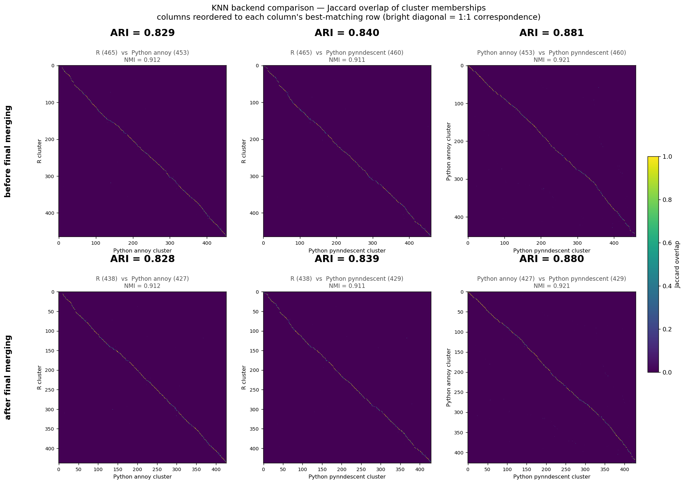
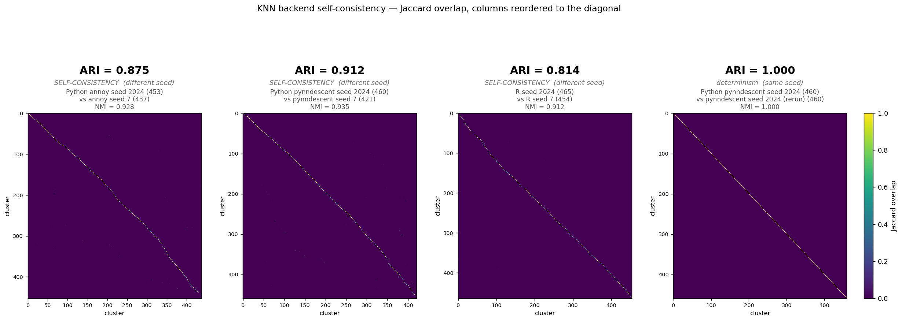
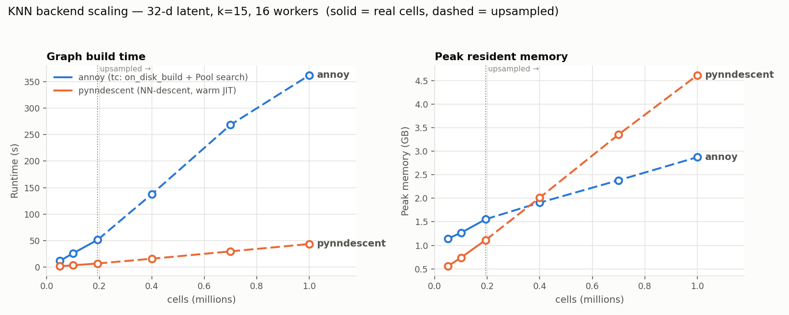

# KNN backends: annoy vs pynndescent, and both against R

`cluster_louvain` can now build its nearest-neighbour graph two ways. This report records what changes
when you switch, measured end to end on the full recursive pipeline — before and after final merging.

**Verdict: the backend is a real but small lever; pynndescent lands slightly closer to R and is the more
reproducible of the two.** It is exactly deterministic at a fixed seed (ARI 1.000) and more stable across
seeds than annoy (0.912 vs 0.875).

**The headline, though, is context:** R's own run-to-run self-consistency is **0.814**, *lower* than
either Python backend's agreement with it (0.829 annoy / 0.840 pynndescent). The R-vs-Python difference
is no larger than R's disagreement with itself.
Agreement with R rises from **ARI 0.829 to 0.840** before final merging (0.828 -> 0.839 after), and
pynndescent also recovers more clusters (460 vs 453, against R's 465). The two Python backends agree
with each other (0.881) more than either agrees with R, so the KNN backend is *not* the main source of
the R-vs-Python gap.

## Using it

Only `knn_method` changes:

```python
'cluster_louvain_kwargs': {
    'knn_method': 'pynndescent',   # or 'annoy' (default, matches scrattch.bigcat)
    'nn_measure': 'euclidean',     # unchanged
    'k': 15, 'annoy_seed': 1, ...
}
```

`nn_measure` needs no change. All five annoy metric names carry over, and the one that has no
pynndescent equivalent is translated: `angular` -> `cosine`. `annoy_seed` feeds pynndescent's
`random_state`, so the graph stays seed-invariant either way; `annoy_trees` is simply ignored (NN-descent
has no forest).

## Results



Jaccard overlap of cluster memberships, columns reordered so each sits under its best-matching row — a
bright diagonal means clean 1:1 correspondence. All six diagonals are tight; the disagreement is in
where clusters split or merge at the margins, not in wholesale reassignment.

**Before final merging**

| comparison | clusters | ARI | NMI |
|---|---|---:|---:|
| R vs Python **annoy** | 465 vs 453 | 0.8294 | 0.9123 |
| R vs Python **pynndescent** | 465 vs **460** | **0.8399** | 0.9107 |
| Python annoy vs Python pynndescent | 453 vs 460 | 0.8813 | 0.9207 |

**After final merging**

| comparison | clusters | ARI | NMI |
|---|---|---:|---:|
| R vs Python **annoy** | 438 vs 427 | 0.8279 | 0.9119 |
| R vs Python **pynndescent** | 438 vs **429** | **0.8388** | 0.9107 |
| Python annoy vs Python pynndescent | 427 vs 429 | 0.8800 | 0.9207 |

Three things worth reading off these:

1. **pynndescent agrees with R slightly better** — +0.011 ARI at both stages. It also under-splits less:
   460 clusters against R's 465, where annoy gives 453.
2. **NMI barely moves** (0.911-0.912 either way) while ARI does. NMI is comparatively insensitive to how
   a few large clusters are subdivided; ARI is not. The backends differ in exactly that: boundary
   placement, not overall structure.
3. **Final merging changes nothing about the ranking.** Every comparison shifts by <0.002 ARI through
   the merge step, so the backend choice propagates through final merging essentially unchanged.

## Self-consistency

Two different questions: is a pipeline **deterministic** (same seed twice -> same answer), and is it
**stable** (does a seed change move the partition much)? All runs are clustering-only, since
self-consistency is a property of the clustering; final merging is deterministic given its input.



| pipeline | seeds | clusters | ARI | NMI |
|---|---|---|---:|---:|
| **Python pynndescent** | 2024 vs 7 | 460 vs 421 | **0.9117** | 0.9347 |
| **Python annoy** | 2024 vs 7 | 453 vs 437 | **0.8748** | 0.9278 |
| **R** | 2024 vs 7 | 465 vs 454 | **0.8144** | 0.9123 |
| Python pynndescent — *determinism* | 2024 twice | 460 vs 460 | **1.0000** | 1.0000 |

All three self-consistency rows use the same seed pair, which matters a great deal: R's self-consistency
is **0.915** at seeds 7 vs 99 (first step, [2_self_consistency.md](2_self_consistency.md)) and **0.833**
at seeds 2024 vs 7 at that same depth, against the **0.814** above (seeds 2024 vs 7, full recursive) — so
any of these numbers is only meaningful quoted together with its seed pair
([why](#why-this-r-number-0814-differs-from-the-0915-in-report-2)).

### R is the least self-consistent of the three

**Both Python backends are more reproducible than R** across a seed change — pynndescent 0.912 and annoy
0.875 against R's 0.814. And pynndescent is **exactly deterministic** at a fixed seed: bit-identical
partitions, 460 clusters both times.

That reframes the cross-pipeline numbers earlier in this report:

| | ARI |
|---|---:|
| R vs Python pynndescent | **0.8399** |
| R vs Python annoy | **0.8294** |
| **R vs R** (its own two seeds) | **0.8144** |

**Both Python backends agree with R more closely than R agrees with itself** (all measured at the same
seeds, 2024 vs 7). The R-vs-Python "gap" of ~0.83 is therefore not evidence of a porting error — it is
the size of R's own run-to-run variability at this seed pair.
This is the same pattern the DE step showed independently
([6_de_all_pairs_R_vs_python.md](6_de_all_pairs_R_vs_python.md)), where two R runs disagreed with each
other more than R disagreed with Python, there because `get_cl_stats_big` subsamples cells with a
non-reproducible seed.

### What the seed actually varies

`annoy_seed` is pinned at 1 **independently** of `random_seed`, deliberately, so the KNN graph is
seed-invariant the way R's is (`BiocNeighbors::buildAnnoy` uses a fixed internal seed that ignores
`set.seed`). Changing `random_seed` therefore varies the **Leiden initialisation and the cell
subsampling** on a graph that is held fixed — it measures Leiden stability, **not** KNN-build stability.
The R runs differ by their top-level `set.seed`, which is the closest equivalent.

The seed change also moves the cluster *count* in every pipeline (460->421, 453->437, 465->454) — all
three split differently at the margins under a different start. NMI moves far less than ARI in all
three, which is the signature of boundary shuffling rather than structural change: ARI is chance-
corrected and unforgiving of granularity mismatch, NMI is not.

### Why this R number (0.814) differs from the 0.915 in report 2

[2_self_consistency.md](2_self_consistency.md) reports R different-seed ARI **0.915**. Both numbers are
correct; they measure different things, and the difference is **mostly the seed pair, not the recursion
depth**. Measured through one code path:

| measurement | recursion | seeds | clusters | ARI |
|---|---|---|---|---:|
| report 2's figure | top level only | **7 vs 99** | 45 vs 49 | **0.9149** |
| same depth, this report's seeds | top level only | **2024 vs 7** | **59 vs 45** | **0.8329** |
| this report's figure | **full recursive** | 2024 vs 7 | 465 vs 454 | **0.8144** |

(Report 2's value reproduces exactly — 0.9149 against its published 0.915 — so there is no measurement
discrepancy.)

Decomposing the 0.915 -> 0.814 drop:

- **seed pair: -0.082** (0.9149 -> 0.8329, both at top level). **Seed 2024 yields 59 top-level clusters
  where seed 7 yields 45** — a 31 % difference in granularity — whereas seeds 7 and 99 happen to agree
  closely (45 vs 49). ARI punishes that granularity mismatch hard.
- **recursion: -0.019** (0.8329 -> 0.8144, both at seeds 2024 vs 7).

So R's top-level cluster *count* is quite seed-sensitive, and which two seeds you compare dominates the
self-consistency number. Recursion adds surprisingly little on top — the recursive refinement largely
inherits and preserves whatever the top level decided.

> **Correction.** An earlier draft of this section attributed the gap to nondeterminism compounding
> across recursion levels, by analogy with
> [4_full_recursive_comparison.md](4_full_recursive_comparison.md), where that is the explanation for
> the *cross-pipeline* R-vs-Python gap. It is not the explanation here: measured at a fixed seed pair,
> recursion accounts for only about a fifth of the difference.

**Implication for the comparison above.** Both Python backends were compared with R at seeds 2024 vs 7,
the same pair, so the ranking (pynndescent 0.912 > annoy 0.875 > R 0.814) is internally consistent. But
an absolute self-consistency figure is only meaningful alongside the seed pair it came from — quoting
"R = 0.814" or "R = 0.915" without that qualifier is misleading either way.

### Note on the earlier R partitions

A fresh R run was needed rather than reusing what was on disk. There is only one other full-recursive
Leiden R partition (`full_R_leiden.csv`, the 465-cluster reference); the three remaining full-scale R
files (`r_clusters.csv` 506, `r2_clusters.csv` 478, `r3_clusters.csv` 485) are from the earlier
**igraph-Louvain, pre-`sample_cells`-fix** era — the configuration
[2_self_consistency.md](2_self_consistency.md) showed was not reproducible even at a fixed seed
(same-seed ARI ~0.79). Using those would have compared a fixed pipeline against a broken one. R's
first-step self-consistency (same-seed 1.00, different-seed 0.91) is also established there, but at ~48
clusters on one level, so it is not comparable to the 465-cluster recursive partitions here.

## Runtime

| stage | annoy | pynndescent | R |
|---|---:|---:|---:|
| clustering | 17 m 19 s | **14 m 54 s** | 2 h 37 m 03 s |
| final merge | 2 m 23 s | 2 m 52 s | 2 m 08 s |
| **total** | 19 m 42 s | **17 m 46 s** | **2 h 39 m 11 s** |

pynndescent came out a little faster here, but these ran on different nodes and node variation on this
cluster is ~2x (see [6_de_all_pairs_R_vs_python.md](6_de_all_pairs_R_vs_python.md)), which is larger
than the 2-minute difference. **Treat the two Python backends as comparable in speed**; the ~8x gap over
R is far outside node noise and is real.

## Scaling to 1M cells — measured

`_knn_scaling_bench.py` times both backends and records **peak RSS of the whole process tree** at
50k → 1M cells on the real 32-d scVI latent (sizes above 194,221 are upsampled with jitter).



| cells | annoy total | pynndescent total | annoy peak | pynndescent peak |
|---:|---:|---:|---:|---:|
| 50,000 | 12.2 s | **1.9 s** | 1.14 GB | **0.56 GB** |
| 100,000 | 26.1 s | **3.7 s** | 1.27 GB | **0.74 GB** |
| 194,221 | 51.8 s | **7.1 s** | 1.56 GB | **1.11 GB** |
| 400,000 | 137.6 s | **16.0 s** | **1.91 GB** | 2.01 GB |
| 700,000 | 268.3 s | **29.9 s** | **2.38 GB** | 3.35 GB |
| **1,000,000** | 361.7 s | **43.7 s** | **2.87 GB** | 4.61 GB |

**pynndescent is 8.3× faster at 1M cells and uses 1.6× the memory — 4.6 GB, not a wall.** It is also
*lighter* than annoy below ~400k cells; the crossover is at 400k, where the two are within 5 %.

Two things keep the memory modest. The pipeline clusters a **32-dimensional latent**, so 1M cells is
only ~128 MB of input; and the index and neighbour graph scale with `n × k`, not with gene count. A
run on thousands of genes rather than a low-dimensional embedding would look different, and this
benchmark does not cover that case.

The time split is also worth noting: annoy's cost is mostly **search**, not build (at 1M: 94 s build,
268 s search), because every cell is queried against the memory-mapped index. pynndescent returns the
neighbour graph from the build itself, so there is no separate search phase.

> **Correction.** Earlier drafts of this report, and `design_choices.md`, argued for keeping annoy as
> the default because its memory-mapped index "is what makes very large datasets tractable", and
> pointed at a `knn_backends.md` for the scaling analysis. That file does not exist — the measurements
> are `knn_scaling_results.csv` and the figure above — and the argument overstated the case: at 1M cells
> annoy saves 1.7 GB and costs 5 minutes. annoy remains the right choice when byte-level comparability
> with scrattch.bigcat matters, or for data that genuinely cannot be indexed in memory (far more cells,
> or many dimensions), but not on this data at this scale.

## Two integration bugs the switch exposed

Both were found only by running the real recursive pipeline — a synthetic check on well-separated blobs
passed on the happy path and revealed neither.

**1. Thread cap.** pynndescent calls `numba.set_num_threads(n_jobs)`, and numba raises above
`NUMBA_NUM_THREADS` (fixed at import from the core count). The pipeline passes `n_jobs=30`, which annoy
handles because it uses a multiprocessing `Pool` with no such ceiling. Result:
`ValueError: The number of threads must be between 1 and 10`, immediately. Fixed by clamping inside the
backend so callers do not have to special-case it.

**2. `-1` padding on small subsets.** pynndescent pads unfilled neighbour slots with `-1`; the recursive
pipeline drills down to groups of 8-71 cells where `k=15` meets or exceeds the number of points. Those
`-1`s reach `csr_matrix` as negative indices:
`ValueError: negative axis 1 index: -1`, **21 minutes in, after 575 clusters had been finalised**. annoy
instead returns `min(k, n)` neighbours. Fixed by clamping `n_neighbors` to `min(k, n)` and folding any
remaining `-1` onto the point itself, which is what annoy effectively yields and keeps the fixed-width
Jaccard/SNN construction valid.

The pattern in both: the backends agree perfectly on the happy path and diverge at the *edges* — thread
limits and degenerate input sizes. Regression tests now cover both
(`test_pynndescent_handles_subsets_smaller_than_k`, `test_pynndescent_clamps_n_jobs_to_numba_thread_cap`).

## When to pick which

| | annoy | pynndescent |
|---|---|---|
| matches scrattch.bigcat | **yes** (`BiocNeighbors::buildAnnoy`) | no |
| agreement with R here | 0.829 | **0.840** |
| memory at 1M cells | **2.87 GB** (index memory-mapped) | 4.61 GB (built in memory) |
| runtime at 1M cells | 361.7 s | **43.7 s** |
| default | no | **yes** |
| accuracy at fixed k | no refinement after the forest is built | iteratively refined, usually more accurate |

**pynndescent is now the default** (`knn_method='pynndescent'`): better agreement with R, exactly
reproducible at a fixed seed, more stable across seeds, and 8× faster at 1M cells for 1.6× the memory.

Reach for **annoy** when byte-level comparability with `scrattch.bigcat` matters, or when the data
genuinely cannot be indexed in memory — far more than 1M cells, or a high-dimensional input rather than
a 32-d latent (this benchmark does not cover that case).

## Reproduce

```bash
cd ../clustering_hicatMPI_pynndescent && ./submit_pipeline.sh   # knn_method='pynndescent'
cd .. && python _compare_pynndescent.py                          # -> pynndescent_metrics.csv
python _make_knn_heatmaps.py                                     # -> images/knn_backend_confusion.png

# self-consistency (clustering only; the 6th sbatch arg is random_seed)
cd clustering_hicatMPI_pynn_rep    && ./submit_pipeline.sh   # pynndescent, seed 2024 again
cd ../clustering_hicatMPI_pynn_seed7  && ./submit_pipeline.sh   # pynndescent, seed 7
cd ../clustering_hicatMPI_annoy_seed7 && ./submit_pipeline.sh   # annoy, seed 7 (control)
cd .. && python _make_selfconsist_heatmaps.py                    # -> images/knn_selfconsistency.png

# R at a second seed, for the R self-consistency panel
cd clustering_bigcat && sbatch --export=ALL,R_SEED=7 sbatch_full_R_leiden_seed.sh
```

Jobs: pynndescent 25238106 (clustering) / 25238107 (final merge); annoy 25236606 / 25236607; R 23280208 /
25050682. Self-consistency: pynndescent rerun 25239192, pynndescent seed 7 25239193, annoy seed 7
25239194, R seed 7 25239483. The annoy run is the same one analysed in
[6_full_recursive_comparision_after_fixing_present.md](6_full_recursive_comparision_after_fixing_present.md);
the scaling benchmark is `_knn_scaling_bench.py` -> `knn_scaling_results.csv` + `images/knn_scaling.png`.
