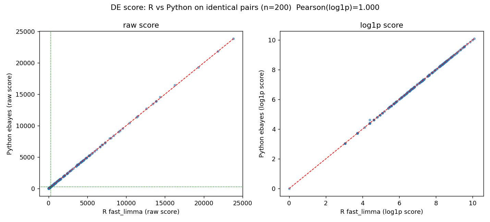

# Clustering modifications — aligning R `scrattch.bigcat` and Python `transcriptomic_clustering`

This documents every source-code and parameter change made to bring the two pipelines into
alignment: (a) the R side clusters on a **precomputed embedding** (scVI latent) instead of an
internally computed PCA and matches the Python clustering/merge behavior; (b) the Python side gains
per-level score thresholds + a `min_samples` parameter and a DE-score cap, and its merge thresholds
are converted for the log2-vs-ln normalization difference.

- Sections 1–4: **R code + calling conventions** (`scrattch.bigcat`).
- Section 5: **Python code** modifications (`hicatMPI` manager + `pybigcat`).
- Section 6: **Python parameter changes** vs the previous config.

> **⚠️ Package fork (2026-07-22): all Python changes now live in `pybigcat`, not `transcriptomic_clustering`.**
> The stock `transcriptomic_clustering` package has been **reverted to pristine** (`git checkout`); every
> alignment change below (`clustering.py`, `diff_expression.py`, `merging.py`) was moved into a new package
> **`pybigcat`** (`/allen/.../tool/pybigcat`, a copy of the repo with the inner package dir renamed and all
> `transcriptomic_clustering` references → `pybigcat`). Work on the alignment continues in `pybigcat` only.
> The active pipeline (`hicatMPI/iterative_clustering_mpi_manager.py`, `final_merging.py`, the sbatch
> `PYTHONPATH`s) and the `decomp/` scripts now import `pybigcat`. Backup of the exact moved diff:
> `decomp/tc_changes_backup.patch`. Historical analysis scripts (`firststep/`, `samegraph/`) still
> reference the pristine `transcriptomic_clustering` and are left as records.

- **Container / runtime (R):** `/shared/utils.x86_64/singularity-3.11/bin/singularity`
  with `/allen/programs/celltypes/workgroups/rnaseqanalysis/dyuan/docker/scrattch_mapping_0.43.sif`
  (R 4.2.3, `scrattch.bigcat`; the `_latest.sif` name does not exist).
  On the `hpc-code` login node add `--no-mount bind-paths -B /allen`.
- **Files modified:**
  - R (`.../test_clustering/clustering_bigcat/`): `cluster_big_modified.R` (modified
    `onestep_clust_big`), `iter_clust_big_modified.R` (modified `iter_clust_big`),
    `clust.R` (driver that sources + installs the overrides).
  - Python (`.../hicatMPI/`): `iterative_clustering_mpi_manager.py`, `sbatch_hicatMPI.sh`,
    `submit_pipeline.sh`; and `.../tool/transcriptomic_clustering/.../diff_expression.py`.
  - Live Python driver: `.../test_clustering/clusterinig_hicatMPI/submit_pipeline.sh`
    (`scripts_dir` → `.../hicatMPI`; final-merge step commented out → clustering only).

---

## Measured effect of each change (where tested)

Quantified impact of each change on the **first clustering step** (194,221 cells / 32-dim scVI, top-level
`onestep`, no recursion). Metrics: ARI = Adjusted Rand Index; "self-consist" = same-pipeline seed7-vs-seed99
ARI; "cross" = R↔Python ARI. Detailed tests in §7, `3_firststep_comparison.md`, `three_way_comparison.md`.

| Change | Test / where | Measured effect |
|---|---|---|
| **SNN graph** (`jaccard_snn`, §5d/§7) vs stock KNN-edge | graph-edge overlap vs R (`decomp/snn_test.py`) | edge Jaccard **0.31 → 0.90**; weight Pearson **0.23 → 0.988** |
| **DE-score cap = 20/gene** (§4/§5b) | DE-score engine test (§7); three-way | with cap, R `fast_limma` ≡ Py `ebayes` (score r=**1.000**, 100% merge-decision agree). Without cap (stock) → **over-split 78–84 cl** vs R 45–49 |
| **Merge #1 (per-round `best`+extras<th/2) + #3 (`num<min_genes`)** | merge-on-shared vs R (§7) | ARI **0.61 → 0.68**; count 50 → 48 (R=42) |
| **Merge #4 (Euclidean candidate metric)** | merge-on-shared vs R (§7) | ARI **0.68 → 0.95**; count 48 → **41** (matches R 42) — the dominant merge fix |
| **`merge_mode` `fast` vs `aligned`** (§7) | merge-on-shared vs R | fast: 0.906 / 52 cl / ~9 min · aligned: **0.954** / 41 cl / ~30–50 min |
| **Fixed `annoy_seed`** (§5e) | first-step diff-seed (`3_firststep_comparison.md`) | Python self-consist **0.51 → 0.77** |
| **`annoy_trees` 17 → 50** (§6) | first-step diff-seed | Python self-consist **0.51 → 0.57** |
| **Leiden vs Louvain** (both) | first-step (`3_firststep_comparison.md`) | self-consist Py 0.77→**0.84**, R 0.91→**0.93**; cross 0.47→**0.52** |
| **`max.cl.size` disabled** (§5c) | no-cap test (§5c) | negligible: R self 0.93→0.92, Py 0.84→0.80, cross 0.52→0.52 |
| **ln-converted thresholds** (`lfc`×ln2, `low`×ln2, `padj` 0.01, `min.cells` 10) (§4/§6) | rationale only (normalization); not isolated | no standalone ARI test — corrects log2-vs-ln scale + over-splitting bias |
| **All changes combined** (`pybigcat` vs stock, same params) | three-way (`three_way_comparison.md`) | **cross R↔Py 0.23 → 0.885**; self-consist 0.869 → 0.910 (≈ R's 0.915); counts 78–84 → 47 (R 45–49) |
| **Edge + merge alignment only** (Leiden held) | first-step (`3_firststep_comparison.md`) | **cross 0.52 → 0.88** |

Baseline "before edge/merge changes" partitions are all retained under `firststep/` (e.g.
`firststep_Py_leiden_s{7,2024}`, `firststep_R_leiden_nocap_s{7,99}`); nothing was overwritten.

---

## How the overrides are installed (`clust.R`)

Because `iter_clust_big` calls `onestep_clust_big` from **inside the package namespace**,
a plain `source()` is not enough — the modified functions are injected into the namespace:

```r
library(scrattch.bigcat)

source(".../cluster_big_modified.R")
environment(onestep_clust_big) <- asNamespace("scrattch.bigcat")   # see unexported internals
assignInNamespace("onestep_clust_big", onestep_clust_big, ns = "scrattch.bigcat")

source(".../iter_clust_big_modified.R")
environment(iter_clust_big) <- asNamespace("scrattch.bigcat")
assignInNamespace("iter_clust_big", iter_clust_big, ns = "scrattch.bigcat")
```

`assignInNamespace` makes the internal call inside `iter_clust_big` resolve to the modified
`onestep_clust_big`. (Note: if `clust.R` ever reintroduces `rm(list=ls())` after this block,
the direct-call copy in the global env is wiped — the namespace copy still works, but the
attached `package:` copy is *not* updated by `assignInNamespace`. Current `clust.R` has no
`rm(list=ls())`, so this is fine.)

---

## 1. `cluster_big_modified.R` — modified `onestep_clust_big`

Base: `scrattch.bigcat::onestep_clust_big`. One step = build KNN graph → Louvain → DE-based merge.

| # | Change | Lines | Why |
|---|--------|-------|-----|
| 1 | **Use supplied embedding instead of internal HVG→PCA.** The `find_vg` / `logCPM` / `rd_PCA_big` / `filter_RD(rm.eigen)` block is commented out; the function now clusters directly on `rd.dat`. Returns `NULL` if `rd.dat` is missing/empty. | 30–59 | Cluster on the scVI latent (matches Python's `latent_project` branch). Consequently `rm.eigen`, `max.dim`, `vg.padj.th`, `maxGenes` are now inert for dimensionality reduction. |
| 2 | **Skip the (now unused) `get_counts` fetch.** The counts/sampling block was removed. | 30–32 | The PCA path that used `counts` is gone; `merge_cl_big` pulls its own counts from `big.dat`. Avoids an expensive fetch on every (recursive) call. |
| 3 | **Subset `rd.dat` to the cells being clustered at this level**, with an early return if too few cells. `rd.dat = rd.dat[intersect(select.cells, rownames(rd.dat)), , drop=FALSE]` | 60–65 | Required for recursion: `iter_clust_big` calls this with `select.cells` = a subcluster, but passes the *full* embedding. Without this, every level would cluster all cells. |
| 4 | **Remove the cluster-count cap on the Louvain/Leiden path.** `max.cl = if(method %in% c("louvain","leiden")) Inf else ncol(rd.dat)*2+1` | 69–71 | Python has no cluster cap. Original R collapsed Louvain output down to `2*ncol(rd.dat)+1` via hierarchical merge (lines 102–107, now never triggered on the Louvain path). ward.D/kmeans keep the cap since they use it as the requested *k*. |
| 5 | **Edge pruning kept at scrattch default `prune = 0.05`** (drops jaccard weight ≤ 0.05 = edges sharing only 1 neighbor at k=15). NOTE stock `jaccard_big` only prunes when a (sub)cluster has **> 50000 cells** (`nbin>1`); ≤50000-cell graphs are returned unpruned. | 88–91 | **Not** an R change — Python was instead modified to replicate this (see §5d). *(This had briefly been set to `prune=0`; reverted to 0.05.)* |

Unchanged pieces that already matched Python: Annoy + Euclidean KNN (`knn.method="Annoy.Euclidean"`),
`k.nn = 15`, Jaccard weighting, igraph `cluster_louvain` (same Blondel multilevel algorithm as
Python's `python-louvain`/"taynaud", resolution = 1).

---

## 2. `iter_clust_big_modified.R` — modified `iter_clust_big`

Base: `scrattch.bigcat::iter_clust_big`. Recursive wrapper that sub-clusters each cluster.

| # | Change | Why |
|---|--------|-----|
| 1 | **Always recurse through `iter_clust_big` (the `big.dat` path).** The original branched on subcluster size: clusters `< 50000` cells were delegated to the in-memory `iter_clust()` → `onestep_clust()`. That branch is removed; every subcluster now recurses via `iter_clust_big` → modified `onestep_clust_big`. | The in-memory `onestep_clust()` has **no `rd.dat` argument and no `...`** — forwarding `rd.dat=latent` to it throws `unused argument (rd.dat = ...)`. So without this change the refine step would **crash** on the first `<50k` subcluster, and the embedding would never be used below the top level. This keeps the embedding in use at **every** level. |

Trade-off: small subclusters now go through the parquet/`big.dat` route instead of in-memory —
slightly slower per call, but correct and embedding-consistent.

---

## 3. Calling conventions in `clust.R` (for alignment)

- `latent = as.matrix(read.csv(latent_pth, row.names=1))` — a **matrix** (not data.frame) is
  required by `get_knn_batch` / `merge_cl_big`.
- `stopifnot(all(select.cells %in% rownames(latent)))` — fail fast if any cell is missing from the
  embedding (the modified function has no internal alignment/intersection safety).
- Top-level `onestep_clust_big(..., rd.dat=latent, ...)` — default `method` is `louvain`.
- `iter_clust_big(..., rd.dat=latent, method="louvain", ...)` — `rd.dat` forwarded via `...` to
  `onestep_clust_big` at every level; `method="louvain"` prevents the `auto` switch to `ward.D`
  for clusters ≤ 2000 cells (Python is always Louvain).

---

## Alignment status

**Aligned after these changes**

| Component | Status |
|---|---|
| KNN backend / metric (Annoy, Euclidean) | ✅ |
| `k` neighbors = 15 | ✅ (see caveat below) |
| Jaccard edge weighting | ✅ |
| Edge pruning (jaccard ≤ 0.05, gated at n>50000) | ✅ (`prune=0.05` both sides; §5d) |
| Louvain algorithm + resolution (Blondel multilevel, res=1) | ✅ |
| No cluster-count cap | ✅ (`max.cl=Inf` on Louvain) |
| Louvain used at every level | ✅ (`method="louvain"`) |
| Clustering on scVI embedding at every level | ✅ |

**Still not identical (by design / outside the clustering step)**

- **Different Louvain libraries** — igraph `cluster_louvain` (R) vs `python-louvain` (Python).
  Same algorithm and resolution, but not bit-identical even with the same graph/seed.
- **Merge step** — `merge_cl_big` (R) vs `merge_clusters` (Python) are different implementations,
  and R normalization is **log2(CPM+1)** while Python is **ln(CPM+1)** (`normalize_total(1e6)` +
  `log1p`). So DE thresholds (`de.score.th`, `q.diff.th`, `q1.th`, fold-change) are **not directly
  portable** — they differ by a factor of `ln(2) ≈ 0.693`. This is the largest remaining source of
  divergence in final cluster counts.
- **`k` clamping** — Python clamps `k = min(15, n_latent_dims)`; R clamps `k = min(15, n_cells/2)`.
  With the current **32-dim** latent, Python's clamp never fires (32 > 15), so both use `k=15` for
  clusters ≥ 30 cells; they differ only for very small clusters (< 30 cells), where R shrinks `k`.
  Revisit only if you switch to an embedding with **fewer than 15 dimensions**.

**Now-inert R parameters** (kept for signature compatibility, no longer affect results on the
embedding path): `rm.eigen`, `rm.th`, `max.dim`, `vg.padj.th`, `maxGenes`, `dim.method`, and the
`sampleSize`-based subsampling (the embedding path clusters all cells in `rd.dat`).

---

## 4. Merge step: normalization difference (log2 vs ln) and threshold alignment

R normalizes to **log2(CPM+1)** (`big.dat_logNormal_parquet`); Python normalizes to **ln(CPM+1)**
(`sc.pp.normalize_total(1e6)` + `sc.pp.log1p`). Both merge steps score DE with a **moderated
t-test** — R `de_pair_fast_limma` (`simple_ebayes`) and Python `de_pairs_ebayes`.

### Re-normalizing to a common log base is NOT required
Going log2 → ln is a constant rescale of log-expression by `c = ln 2 ≈ 0.693`. In a moderated
t-test the `c` cancels: `t = means_diff / (sqrt(var) · stdev.unscaled)` — numerator scales by `c`,
`sqrt(var)` scales by `c`, `stdev.unscaled` depends only on cell counts. So **t-stat, p-value,
p_adj, and the DE score are all scale-invariant.** Only quantities read directly in log units are
scale-sensitive. Therefore the normalization difference is handled by **adjusting thresholds**, not
by re-normalizing.

### Which thresholds are scale-dependent (need ×ln2 conversion)

| Threshold | R default (log2) | Python sbatch (ln) | Scale-dependent? | Notes |
|---|---|---|---|---|
| `low.th` / `low_thresh` (defines "expressed") | 1 | 0.6931472 | **Yes (×ln2)** | ✅ converted |
| `lfc.th` / `lfc_thresh` (`abs(lfc) > th`) | 1 | ~~1~~ → **0.6931472** | **Yes (×ln2)** | ✅ **fixed** (was 1) |
| `de.score.th` / `score_thresh` | 150 | 150 | No (t-test invariant) | see cap fix below |
| `q1.th`, `q.diff.th`, `q2.th` | 0.5, 0.7, NULL | 0.5, 0.7, None | No (proportions) | ✅ |
| `padj.th` / `padj_thresh` | 0.01 | ~~0.05~~ → **0.01** | No | ✅ **aligned** |
| `min.cells` / `cluster_size_thresh` | 10 (`clust.R`) | ~~20~~ → **10** | No | ✅ **aligned** |
| `min.genes` | 5 | 5 | No | ✅ |

`lfc = mean(logExpr_A) - mean(logExpr_B)`, so it scales by `c`. R's `lfc.th=1` is on log2; the
matching ln-scale value is `1·ln2 = 0.6931472`. Leaving it at `1` on ln data is ~1.44× too strict
(equivalent to a log2 threshold of 1.44 → 2.7× vs 2.0× fold separation), biasing Python toward
slightly coarser clusters at fine boundaries.

### Structural difference NOT fixable by thresholds: the DE-score per-gene cap
R `de_stats_pair` clips each gene's `-log10(padj)` to **20** before summing
(`tmp[tmp>20]=20`). Python `calc_de_score` summed uncapped (allowed `inf`), so Python scores were
systematically ≥ R scores → Python cleared `score_thresh` more easily → **over-split / merge less**.
This is independent of normalization.

### Fixes applied

1. **`.../tool/transcriptomic_clustering/transcriptomic_clustering/diff_expression.py`**,
   `calc_de_score`: cap each gene's `-log10(padj)` at 20 (`np.minimum(..., 20)`) to match
   scrattch.bigcat (also bounds the `padj==0` → `inf` case to 20). Shared by both the `ebayes`
   and `chisq` DE paths. (See §5b.)
2. **Merge thresholds** in the live Python driver
   `.../test_clustering/clusterinig_hicatMPI/submit_pipeline.sh` aligned to R (`clust.R`):
   `lfc_thresh 1 → 0.6931472`, `padj_thresh 0.05 → 0.01`, `cluster_size_thresh → 10` (see §6).
   `lfc/padj` are tighter → fewer DE genes → lower scores → more merging.
   *(An earlier `.../from_YG/09b_..._lfcfix.sh` is **stale** — it points to a non-existent
   `custom_packages/mpi_tc/hicatMPI/` path. Use the `clusterinig_hicatMPI` driver.)*
3. **Per-level score thresholds + `min_samples`** now exposed in the manager (see §5a), so the
   top-level/recursive `de.score.th` split and the `split.size` mismatch are resolved in code.

### Still divergent (structural, reconcile separately if exact parity needed)
- **No global final merge in R** — R `iter_clust_big` merges only within each step; the Python
  pipeline adds a separate `final_merging.py` phase. Compare R's iter result to Python's
  `clusters_before_final_merge` (the `clusterinig_hicatMPI` driver runs clustering only).
- **`simple_ebayes` (R) vs `de_pairs_ebayes` (Python)** — same moderated-t method, minor
  variance-moderation / df implementation differences.
- **Different Louvain libraries** — igraph `cluster_louvain` (R) vs `python-louvain` (Python);
  not bit-identical even with identical graph + seed.

---

## 5. Python code modifications (`hicatMPI` + `transcriptomic_clustering`)

Two Python source changes, separate from parameter *values*:

### 5a. `iterative_clustering_mpi_manager.py` — expose `min_samples` + per-level score thresholds

| Change | Was | Now |
|---|---|---|
| `min_samples` (min cluster size to keep sub-clustering) | **hardcoded `= 4`** | function parameter (default 4), read from CLI arg `[5]` |
| Merge DE `score_thresh` | single value from `clust_kwargs`, same at every level | **two** thresholds: `score_thresh_top` (manager's first/top-level clustering) and `score_thresh_recursive` (workers' recursive sub-clustering), CLI args `[6]`, `[7]` |

Mechanism: the manager deep-copies `merge_clusters_kwargs` into a `top` and a `recursive` variant
(overriding only `thresholds.score_thresh`), builds `clust_kwargs_top` / `clust_kwargs_refine`,
uses **top** for its own first `onestep_clust`, and embeds **recursive** in every worker task. If a
score threshold is not supplied (`None`), it falls back to the `score_thresh` in `clust_kwargs`
(backward compatible). The **worker was not changed** — it already runs `onestep_clust` with the
per-task kwargs. This mirrors R (`de.score.th=300` top-level / `150` refine; `split.size=10`).

Plumbing: `sbatch_hicatMPI.sh` accepts positional `$6=min_samples`, `$7=score_thresh_top`,
`$8=score_thresh_recursive` (default `None`) and forwards them to the manager; `submit_pipeline.sh`
sets them as shell vars and passes them through.

### 5b. `.../transcriptomic_clustering/diff_expression.py` — `calc_de_score` 20-cap
Caps each gene's `-log10(padj)` contribution at 20 (was uncapped, allowed `inf`), matching
scrattch's `de_stats_pair`. Prevents Python from systematically over-scoring pairs distinguished by
a few ultra-significant genes → was over-splitting relative to R. (See §4.)

### 5c. `.../transcriptomic_clustering/merging.py` — per-cluster cell cap (`max.cl.size`)
`merge_clusters_by_de` now caps the per-cluster cell count used **in the DE test** at
`max_cl_size` (default **300**, matching R `merge_cl_big`'s `max.cl.size`). Implemented as
`cl_size_de = {c: min(n, max_cl_size) for c, n in cl_size.items()}`, recomputed each merge round
(so a merged cluster is re-capped too), and passed to `de_pairs_ebayes` / `de_pairs_chisq`.

Why it matters: R computes DE stats from ≤300 cells/cluster; Python previously used **all** cells,
so `stdev_unscaled = sqrt(1/n_a + 1/n_b)` shrank and `df` grew → smaller p-values → more genes
cleared `padj`/`q·cl_size` gates → higher scores → Python **merged less** (over-split) for large
clusters. Capping `n` in the test removes that bias. The cluster **means/variances/present** are
left computed from all cells (stable at ≥300, so negligible difference; only the test's *power* is
capped). Tunable via a `max_cl_size` key in `merge_clusters_kwargs.thresholds`.

**UPDATE — the cap is now DISABLED in both pipelines (use all cells per cluster in the merge DE):**
- **Python** (`merging.py`): default changed to `max_cl_size = thresholds.pop('max_cl_size', None)`;
  when `None`, `cl_size_de = cl_size` (no cap). Re-enable by setting an integer `max_cl_size` in
  `merge_clusters_kwargs.thresholds`.
- **R** (`clust.R`): `onestep_clust_big(..., max.cl.size=Inf)` and `iter_clust_big(..., max.cl.size=Inf)`
  — `sample_cells(cl, Inf)` returns all cells per cluster (verified), so no subsampling.
- Both sides still **aligned** (both use all cells) — just at the no-cap setting instead of the 300-cap.
  Effect: larger clusters get full statistical power in the DE test → more genes pass → higher scores →
  **less merging / more clusters** (vs the 300-cap), and slower/heavier merges. The earlier
  full-pipeline and first-step results (§4, `3_firststep_comparison.md`) used the 300-cap; reruns under
  the no-cap setting will differ.

**Measured effect of disabling the cap (first-step, Leiden, ARI):**

| Comparison | max.cl.size=300 | no cap |
|---|---|---|
| R Leiden self, diff-seed (7 vs 99) | 0.93 (48/50 clusters) | 0.92 (45/49) |
| Python Leiden self, diff-seed (2024 vs 7) | 0.84 (47/58) | 0.80 (47/58) |
| R↔Python Leiden cross | 0.52 | 0.52 |

So disabling the cap **barely changed** the outcome — R self-consistency essentially unchanged (0.93→0.92),
Python self slightly lower (0.84→0.80), and the R↔Python cross unchanged (0.52). Conclusion: at this
scale `max.cl.size` is **not** a meaningful driver of the R↔Python difference; use-all-cells vs cap-300
give effectively the same clustering. (Jobs: `fs_RleiNC` 23273109, `fs_PyleiNC` 23273110 vs the capped
`fs_Rlei`/`fs_Pylei`.)

### 5d. `.../transcriptomic_clustering/clustering.py` — Jaccard edge pruning (`prune=0.05`, gated)
`cluster_louvain` now drops Jaccard edges with `weight ≤ jaccard_prune` (default **0.05**) — but
**only when the current graph has > `jaccard_prune_min_size` cells (default 50000)** — to replicate
R `jaccard_big`, which prunes inside `if (nbin>1)` where `nbin = ceil(n/50000)`. Both params are
`cluster_louvain` args (settable via `cluster_louvain_kwargs`); defaults match R.

**Per-level correctness:** the gate is evaluated on `nn_adata.n_obs` — the cell count of the
**current** clustering call — so at every recursion level it prunes iff *that* level has >50000
cells, exactly mirroring R (`onestep_clust_big` recomputes `nbin` per call). For millions of cells,
2nd/3rd levels still >50k prune on both sides; levels ≤50k prune on neither. R was reverted from the
temporary `prune=0` back to the stock `0.05` (see §1 row 5).

### 5e. Config: `annoy_trees=50` in `cluster_louvain_kwargs` (KNN stability + sync with R)

Added `'annoy_trees': 50` to `cluster_louvain_kwargs` in `submit_pipeline.sh`
(`clusterinig_hicatMPI/` and `hicatMPI/`).

- **Why:** `cluster_louvain`/`get_annoy_knn` leave `annoy_trees=None` by default, which falls to the
  heuristic `annoy_trees = max(1, int(log2(n_cells)))` — only **17 trees** for 194k cells (and it
  barely grows: ~20 at 1M, ~23 at 8M). R's `get_knn_batch` uses a **fixed `ntrees = 50`**, independent
  of n. So Python was building a much sparser/noisier approximate KNN forest than R.
- **Effect:** more trees → higher-recall, more *stable* approximate KNN → less seed-to-seed variation
  in the graph (and closer to R). This both **syncs** the KNN construction with R and **improves
  Python's cross-seed stability**.
- **Measured (first-step diff-seed ARI, Python 2024 vs 7):** 17 trees → **0.51**; 50 trees → **0.57**
  (reciprocal-Jaccard 0.89 → 0.94). Same-seed stays **1.00** at 50 trees (determinism preserved).
  So more trees gives only a **modest** stability gain — the KNN-graph noise is a *minor* contributor;
  most of Python's seed sensitivity is the `python-louvain` clustering step itself (still 0.57 vs R's
  0.91). See §5f for the same-graph isolation test that confirms this.

### 5f. Same-graph isolation test — attributing the Louvain instability

Built ONE Jaccard KNN graph (`annoy_trees=50`, k=15; 194,221 nodes / 2.9M edges) and clustered the
**identical** graph with each method twice (files in `samegraph/`).

| Method (same graph) | same-seed ARI | diff-seed ARI |
|---|---|---|
| igraph Louvain (R) | 1.00 | 0.87 |
| python-louvain (taynaud) | 1.00 | 0.89 |
| python Leiden (vtraag) | — | 0.92 |
| igraph vs python-louvain (cross, seed 1) | — | 0.85 |

**Findings:**
1. **Both Louvain implementations are comparably seed-stable on a fixed graph** (igraph 0.87 ≈
   python-louvain 0.89), and both are deterministic at a fixed seed (1.00). This **revises the earlier
   hypothesis** that `python-louvain` was the main instability source — it is not.
2. **Leiden is modestly more stable** (0.92 > 0.87–0.89).
3. **igraph vs python-louvain on the identical graph+seed differ (0.85)** — a genuine implementation
   difference (different modularity local optima) that feeds the R↔Python cross gap.
4. **The KNN graph, not Louvain, dominates Python's cross-seed instability.** Fixed-graph Louvain is
   ~0.89, but Python's full first-step diff-seed is only 0.57 — the drop comes from the **Annoy graph
   being rebuilt differently per seed**: `get_annoy_knn` does `ai.set_seed(random_seed)`, so changing
   the clustering seed also changes the graph. **R (proven): its Annoy KNN is seed-INVARIANT** — R uses
   *approximate* Annoy (`BiocNeighbors::buildAnnoy`, `ntrees=50`), **not exact KNN**, but `buildAnnoy`
   is not tied to R's `set.seed`, so R's KNN is identical across seeds (empirically: `findKNN` gives
   100% identical neighbors for `set.seed(7)` vs `set.seed(99)`). So R's graph is fixed across seeds →
   only Louvain varies (~0.87) → the DE-merge coarsens it up to 0.91. (More annoy_trees barely helped
   Python: 0.51→0.57 — approximate KNN stays seed-variable *when reseeded per run*.)

**Lessons to stabilize Python (and keep it synced with R):**
- **#1 — make Python's Annoy build seed-invariant** (do NOT pass the clustering run seed to Annoy; use
  a fixed constant seed, or reuse one cached index). This mirrors R exactly. Then a seed change
  perturbs only Louvain (~0.89), not the graph → Python's cross-seed stability jumps toward R's. This
  is the biggest lever. **Exact KNN is NOT required** — R itself uses approximate Annoy.
  **Implemented & measured:** added `annoy_seed=1` to `cluster_louvain` (KNN uses `annoy_seed`, not the
  run seed). Python first-step diff-seed ARI rose **0.51 (17 trees) / 0.57 (50 trees) → 0.766 (fixed
  Annoy seed)** — a +0.26 jump toward R's 0.91, confirming the reseeded KNN graph was the dominant
  driver. (It stops at 0.77 rather than the ~0.89 fixed-graph Louvain ceiling because the DE-merge
  amplifies the residual Louvain differences.)
- **#2 — switch both to Leiden** (`louvain_method='vtraag'` in Python, `method="leiden"` in R) for a
  further small gain and algorithm sync.
- `annoy_trees=50` (§5e, done) is a minor help; consensus clustering is strongest but most expensive.

---

## 6. Python parameter changes vs the previous config

**Previous** = original hicatMPI defaults (e.g. `.../hicatMPI/submit_pipeline.sh` before this
alignment work). **New** = `.../test_clustering/clusterinig_hicatMPI/submit_pipeline.sh`. Applies to
**both** `clust_kwargs` and `final_merge_kwargs` unless noted.

| Parameter | Previous | New (aligned) | Why |
|---|---|---|---|
| `min_samples` (split size) | 4 (hardcoded) | **10** | == R `iter_clust_big` `split.size` |
| `score_thresh` — top level | single value, all levels | **`score_thresh_top=300`** | == R `clust.R` top-level `de.score.th` |
| `score_thresh` — recursive | single value, all levels | **`score_thresh_recursive=150`** | == R refine `de.score.th` / bigcat default |
| `lfc_thresh` | 1 | **0.6931472** (= ln2) | ln-scale match to R `lfc.th=1` on log2 |
| `padj_thresh` | 0.05 | **0.01** | == R `de_param` default `padj.th` |

Already aligned in the previous config (not changed this round): `low_thresh=0.6931472`,
`cluster_size_thresh=10`, `q1_thresh=0.5`, `qdiff_thresh=0.7`, `min_genes=5`, `k=15` (louvain),
`k=4` (merge), `de_method='ebayes'`, Annoy / Euclidean / Jaccard / taynaud / resolution=1.

Notes:
- The `score_thresh` inside `clust_kwargs` (still `100`) is now a **fallback only** — the manager
  overrides it with `score_thresh_top` / `score_thresh_recursive`.
- `final_merge_kwargs` matters only if the final-merge step is enabled; the `clusterinig_hicatMPI`
  driver comments it out (clustering only), so its thresholds are currently unused.

---

## 7. Per-stage decomposition of the R↔Python difference (first step)

Cross-language study attributing the R↔Python divergence to each stage, by sharing intermediates
(files in `decomp/`, `samegraph/`).

| Stage | How isolated | Result |
|---|---|---|
| **1. KNN / graph** | R's Jaccard graph vs Python's, same latent (k=15, trees=50) | edge Jaccard **0.31**; R **5.7M** edges vs Python **1.9M**; 92% of Python's edges ⊂ R, only 31% of R's ⊂ Python; weight corr 0.23 |
| **2. Community** | igraph vs python-louvain/leiden on the **identical** graph (§5f) | ARI **0.85** (Louvain), **0.92** (Leiden) |
| **3. DE / merge** | R `merge_cl_big` vs Python `merge_clusters` on the **identical** 79-cluster partition | ARI **0.61** (R→42, Python→50 clusters) |

### Headline: R and Python build structurally different graphs
- **R `jaccard_big`** builds a **full SNN / Jaccard graph** — `crossprod` connects *every pair of cells
  sharing ≥1 neighbor* (dense, 5.7M edges).
- **Python `_jaccard_csr_from_nn_dict`** builds a **KNN-edge graph with Jaccard weights** — edges only
  between a cell and its *direct k neighbors* (sparse, 1.9M edges).
- 92% of Python's edges are a subset of R's → the underlying **Annoy KNN mostly agrees** (per-seed
  randomness is the small ~8%); the ~3× extra R edges are the **second-degree SNN edges Python omits**.
  This graph-construction difference is **larger than Annoy seed noise, Louvain, or DE**.

### Ranking of divergence sources (most → least, and matchability)
1. **Graph construction (biggest, structural, fully matchable):** SNN (R) vs KNN-edge (Python) Jaccard.
   Match by making Python build the full SNN graph, or R restrict to KNN edges.
2. **DE/merge (moderate):** ARI 0.61 on identical input; R merges more aggressively (42 vs 50).
   Reconcile via merge thresholds / `fast_limma` vs `ebayes`.
3. **Community detection (mild):** 0.85–0.92 on identical graph; largely irreducible (diff
   implementations), Leiden closer.
4. **Annoy per-seed randomness (small):** ~8% of edges; already handled by the fixed-seed fix (§5e/§5f).

### Validation: matching R's SNN construction closes the graph gap
Added `weighting_method='jaccard_snn'` to Python (`_jaccard_snn_csr_from_nn_dict` in `clustering.py`):
builds the graph via `B · Bᵀ` (crossproduct of the KNN adjacency) so every pair sharing ≥1 neighbor
gets an edge with weight `shared / (2k − shared)` — the exact R `jaccard_big` construction. Rebuilt
Python's graph from the same scVI latent (k=15, trees=50, `annoy_seed=1`) and compared its edge set to
R's exported graph (`decomp/decomp_R_graph_edges.csv`), applying R's `prune=0.05` to both:

| | Old (Python KNN-edge) | New (Python `jaccard_snn`) |
|---|---|---|
| Edge count | 1.9M vs R 5.7M | **5,680,154** vs R **5,679,229** |
| Shared edges | — | **5,377,275** |
| **Edge Jaccard vs R** | **0.31** | **0.899** |
| Frac of each in the other | ~0.9 / 0.31 | **0.947 / 0.947** |
| **Weight Pearson (shared)** | **0.23** | **0.988** |

- Construction-method fix moved graph overlap **0.31 → 0.90** and weight correlation **0.23 → 0.988** —
  confirming SNN-vs-KNN topology was the dominant, previously-missed difference.
- **Residual ~0.10** (5.3% of union edges unique to one side) is now purely the **Annoy-neighbor
  difference** (R and Python build different forests; irreducible without exact KNN) plus prune-boundary
  effects — not construction.
- No-prune check: unpruned Python SNN (13.5M edges) **contains 99.2% of R's edges** → the two agree on
  *which* pairs share neighbors; they had differed only by prune + the SNN expansion Python omitted.
- Repro: `decomp/snn_test.py` (via `decomp/snn_test.sbatch`, 64G — the crossproduct edge arrays OOM the
  login node); SLURM job 23273470.

### Diagnostic: DE-score engine (`fast_limma` vs `ebayes`) is NOT the merge driver
To attribute the DE/merge gap (ARI 0.61, R→42 vs Py→50) to either the **score engine** or the **merge
control flow**, computed R `fast_limma` and Python `ebayes` DE scores on the **identical** set of 200
k=4 nearest-cluster pairs from the shared 79-cluster partition (each in its native normalization +
converted thresholds). Scripts: `decomp/_de_scores_py.py` (also writes the shared `de_pairs.csv`),
`decomp/_de_scores_R.R`, `decomp/_de_compare.py`; SLURM 23273584 (Py) / 23273585 (R).

| Metric | Value |
|---|---|
| score Pearson / Spearman | **1.000 / 1.000** |
| `#DE-genes` Pearson | **1.000** |
| **merge decision @ score<300 agreement** | **1.000** (both merge the same **44/200**, 0 only-R, 0 only-Py) |
| median \|Δscore\| | **0.0** (score range 0–23,831) |
| pairs with any diff | 21/200 (max \|Δ\|=220, ~≤11 DE-genes; symmetric: 21 lower in R, 25 in Py) |



*R `fast_limma` vs Python `ebayes` DE score per cluster pair (left: raw; right: log1p). Points sit on the
identity line; the green lines mark the `score_thresh=300` merge boundary — no pair crosses it differently
between the two engines.*

- **The two DE engines are effectively identical:** most pairs match to the digit; the ~10% that differ
  do so by a few DE genes (minor eBayes df/variance-moderation differences) at the high end of the score
  range, and **never flip a merge decision** at the threshold.
- **Conclusion:** the entire 42-vs-50 divergence is the **merge control flow**, not the score. R merges
  the single lowest-score pair per round + extras only below `de.score.th/2`, then recomputes; Python
  merges *all* non-conflicting pairs below the full `score_th` per round. → **No need to port
  `fast_limma`.** Align by porting R's per-round rule (change #1) + the `num<min.genes` off-by-one (#3).

### Revised ranking of DE/merge divergence sources
1. **Merge control flow (the whole DE/merge gap):** per-round `th` (Python) vs `best + extras<th/2`
   (R), and the recompute/greedy order. Fully alignable in `pybigcat.merging.merge_clusters_by_de`.
2. **DE score engine:** *not* a factor — `fast_limma` ≡ `ebayes` (r=1.000, 100% decision agreement).

### Implemented merge alignment (#1, #3, #4) — merge-on-shared ARI 0.61 → 0.95
Applied in `pybigcat/merging.py` (`merge_clusters_by_de` + `calculate_similarity`), then re-ran the
merge on the identical 79-cluster partition and compared to R (R baseline unchanged, 42 clusters):

| Config (cumulative) | Py clusters | ARI vs R | NMI vs R |
|---|---|---|---|
| Pre-alignment (stock loop, correlation metric) | 50 | 0.608 | 0.923 |
| **#1** per-round `best + extras<th/2` + **#3** `num<min_genes` (strict) | 48 | 0.676 | 0.938 |
| **#4** Euclidean candidate-pair metric (matches R `get_knn_pairs` `Annoy.Euclidean`) | **41** | **0.954** | **0.987** |

- **#1** (`merge_clusters_by_de`): rewrote the per-round rule — merge the single lowest-score pair
  unconditionally, then extras only if `score < score_th/2`; re-examine **all** clusters' k-nearest
  pairs each round (R defers borderline pairs and reconsiders them) with a DE cache keyed by
  `frozenset(pair)` (mirrors R's `de.genes` cache; entries touching a merged cluster are invalidated).
- **#3**: candidate test is now R's `test_merge` — `score < score_th OR num < min_genes` (strict `<`).
- **#4** (`calculate_similarity`): switched the reduced-space nearest-cluster metric from **correlation**
  to **Euclidean** (`cdist_normalized`, = R's `1 - dist/max(dist)`). This was the dominant fix — it
  aligns the *candidate pairs* fed to the DE merge (and the small-cluster pre-merge), moving ARI
  0.68→0.95. Used by both `merge_clusters_by_de` and `merge_small_clusters`.
- **Net:** Python now merges 79→41 vs R's 79→42, ARI **0.954** on identical input — the DE/merge stage
  is essentially matched. Repro: `decomp/_run_decomp_py.py` (SLURM 23273642 for #1+#3, 23273668 for #4);
  `decomp/_merge_compare.py`.
- **⚠ Performance:** the aligned loop is slow (~53 min for one 79-cluster merge) — a pandas
  chained-assignment **warning flood** (~17k tracebacks/run to the `/allen` network FS) plus `.loc`/`.drop`
  on 30k-column mean/var/present DataFrames each merge. Suppressing warnings helps (~20 min saved) but the
  loop is still ~30–50 min because it is inherently **many rounds** (merges ~1 pair/round).

### Merge speed option: `merge_mode` (`'aligned'` default vs `'fast'`)
Added a `merge_mode` toggle to `merge_clusters_by_de` (read from the thresholds dict):
- **`'aligned'`** (default) — R-faithful: re-examine all clusters' k-nearest each round, merge best +
  extras < `score_th/2`, recompute. Highest fidelity.
- **`'fast'`** — previous behavior: after round 1 only re-examine merged-destination neighbors, merge
  **every** non-conflicting candidate < `score_th` per round. Far fewer rounds. **Keeps #4** (Euclidean
  candidates), so it retains most of the alignment win.

Merge-on-shared benchmark (warnings suppressed, 79→ clusters, vs R=42):

| Mode | Clusters | ARI vs R | Merge time |
|---|---|---|---|
| stock (pre-alignment) | 50 | 0.608 | ~47 s |
| **`fast`** (+#4) | 52 | **0.906** | **541 s** |
| **`aligned`** (+#1+#4) | 41 | **0.954** | ~30–50 min |

- **#4 alone (in `fast` mode) recovers most of the gain** (0.61→0.906); the aligned loop adds fidelity
  (0.906→0.954) and matches R's cluster count (41 vs 42; `fast` over-splits to 52) at ~5× the cost.
- **Decision:** default `merge_mode='aligned'` (fidelity is the goal), expose `'fast'` for speed
  (e.g. the recursive full pipeline where the aligned cost compounds). Repro:
  `decomp/_run_decomp_py_fast.py` (env `MERGE_MODE`), SLURM 23276269.
- **Future optimization** (keeps aligned fidelity): cache/vectorize `de_pairs_ebayes` (avoid rebuilding a
  30k-row DataFrame + genome-wide variance moderation per pair per round), and replace per-merge
  `.loc`/`.drop` on wide DataFrames with numpy-level updates.

#### Merge speed fix (implemented) — `no_gc_collect` + numpy `de_pairs_ebayes`
Two root causes were fixed, both **behavior-preserving** (verified bit-identical DE output on synthetic
pairs: `up/down_score`, `up/down_num`, and both gene sets match the old path exactly):
1. **GC storm.** `statsmodels.multipletests()` calls `gc.collect()` on *every* call; in the per-pair loop
   that fires a full collection thousands of times (~90% of merge wall-clock). `gc.disable()` cannot stop
   it (the collect is explicit), so added a `no_gc_collect()` context manager (`diff_expression.py`) that
   neutralizes `gc.collect` around each `multipletests` call. Applied in `de_ebayes.py`,
   `de_pair_chisq`, and `de_all_pairs`.
2. **Per-pair pandas overhead.** Rewrote `de_pairs_ebayes`'s inner loop from a per-pair 8-column
   DataFrame + `filter_gene_stats` to pure numpy boolean masks (same filter logic). `process_pair` (the
   parallel *marker*-selection variant) was left on the pandas path.

Measured (synthetic aligned merge):

| Case | before | + `no_gc_collect` | + numpy loop |
|---|---|---|---|
| 100×2000 | 63.7 s | 6.2 s | **1.9 s** |
| 120×6000 | — | 14.2 s | **3.8 s** |
| 150×5000 | >120 s | — | **4.3 s** |

**~30× faster overall** on synthetic data. But profiling the *real* merge (194k cells, 17,277 genes,
91 raw clusters) showed the DE work was no longer the bottleneck — see the next fix.

#### Merge speed fix #2 (implemented) — numpy-level merge updates
A cProfile of the real fast merge (1,605 s) revealed **74 % was `numpy.array` construction driven by
pandas `.loc[row]=` / `.drop` on the wide (×17,277) mean/var/present DataFrames** — each row-assignment
re-introspects every column's dtype, ~69k times. This is the "future optimization" noted above, now done:
`merge_clusters_by_de` holds means/vars/present as **numpy arrays** with a `label→row` map, combines rows
arithmetically in place, and rebuilds small DataFrames only for the per-round DE call (returning the merged
frames to the caller for marker selection).

- **Bit-identical** to the old path: assignments, means, variances, present all Δ=0 (both merge modes,
  multiple seeds). One subtlety replicated exactly — the old variance formula's `(mean2 − mean_comb)²`
  term was silently zero (a pandas `.loc` view was overwritten to `mean_comb` before the variance line),
  so the numpy version drops that term to match.

Measured on the real top-level merge (91 raw clusters → merged):

| Merge mode | before | after numpy merge | speedup |
|---|---:|---:|---:|
| `fast` | 1,605 s (26.8 min) | **78 s** | **~21×** |
| `aligned` | 8,918 s (2 h 29 m) | **62 s** | **~144×** |

The whole top-level pass (clustering + aligned merge) drops from ~2.5 h to **~3 min**, so full recursive
pybigcat aligned is now **much faster than R (2 h 37 m)** at identical results.

**End-to-end no-op confirmed:** the old `.loc` merge was re-run through the entire recursive pipeline
(job 23305439) and compared cell-for-cell to the numpy run — **454 vs 454 clusters, ARI = 1.000** (not
just similar, identical). So the ~8× full-pipeline speedup changes nothing in the output.
