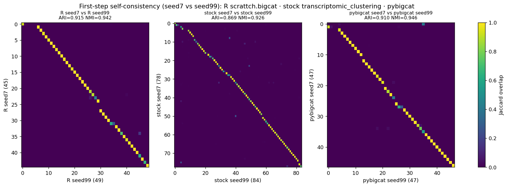
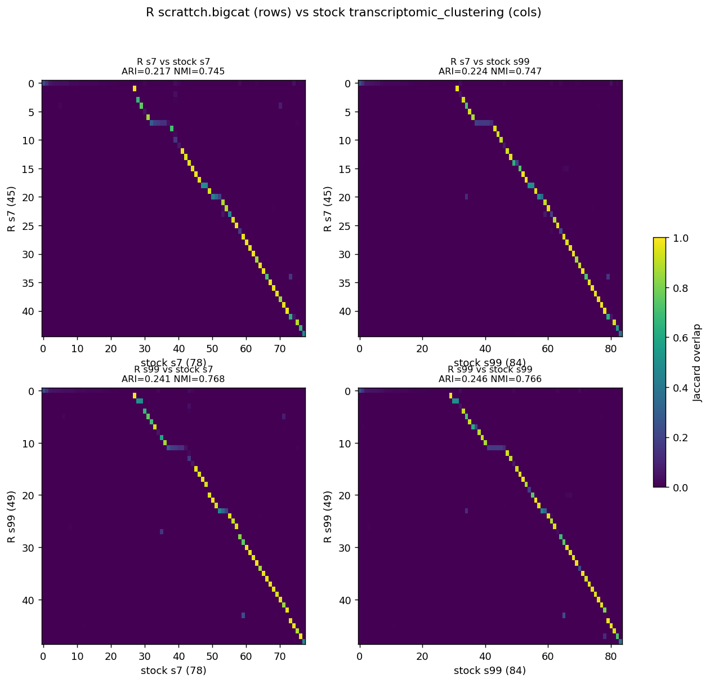
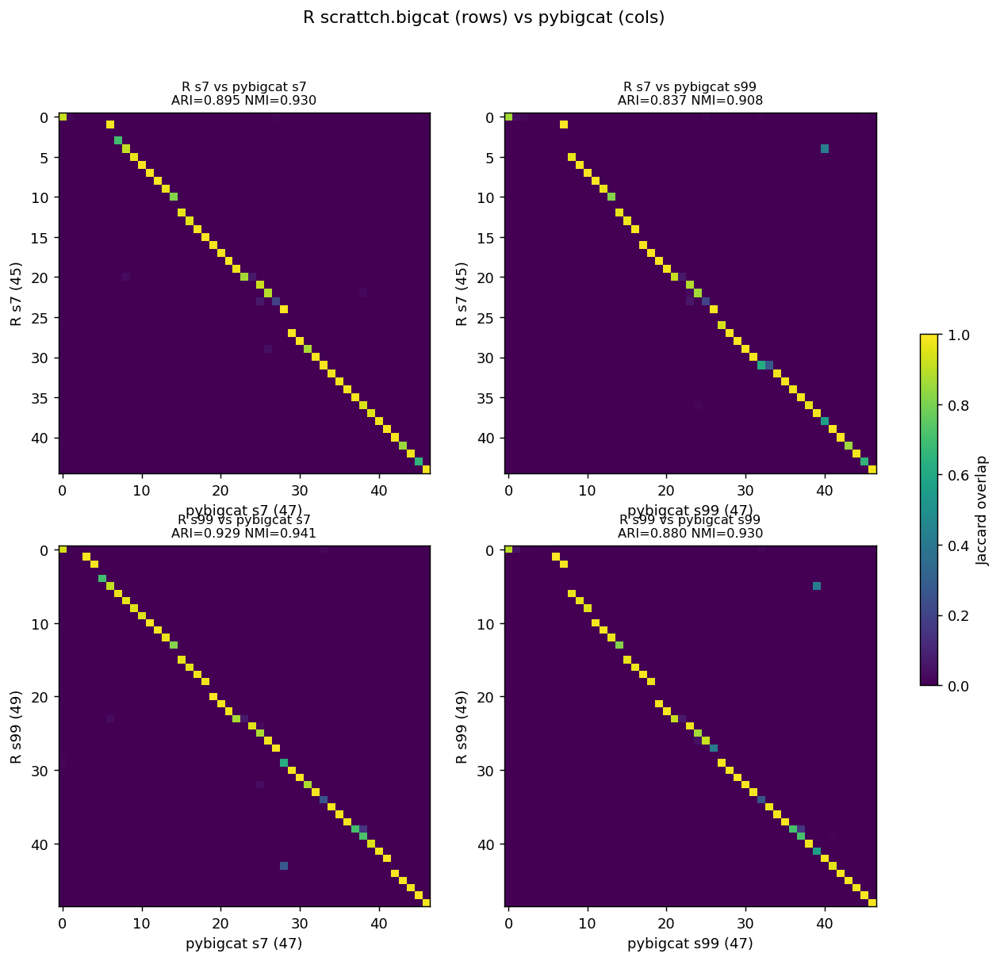

# Three-way first-step comparison: R `scrattch.bigcat` vs stock `transcriptomic_clustering` vs `pybigcat`

A first-step (top-level `onestep`, no recursion) comparison of three clustering pipelines on the same
194,221 cells / 32-dim scVI embedding, at two seeds (7, 99):

1. **R `scrattch.bigcat`** — Leiden, no cap, with the `sample_cells` **seed fix** (so it is reproducible
   at a fixed seed). This is the reference.
2. **Stock `transcriptomic_clustering`** — the pristine upstream Python package (KNN-edge Jaccard graph,
   Annoy seeded by the run seed, **no DE-score cap**, stock merge loop).
3. **`pybigcat`** — the bigcat-aligned fork (SNN Jaccard graph, fixed Annoy seed, DE-score cap 20,
   aligned DE-merge #1/#3/#4, `max.cl.size` disabled).

**The two Python packages are run with identical tuning parameters** — `k=15`, 50 Annoy trees, Leiden
(`vtraag`), `resolution=1.0`, DE/merge thresholds (`score_thresh=300`, `padj 0.01`, `lfc 0.6931`,
`low 0.6931`, `q1 0.5`, `qdiff 0.7`, `min_genes 5`, `cluster_size 10`), merge `k=4`, `de_method='ebayes'`.
The differences between them are therefore **code only** (graph construction, DE cap, merge
implementation, Annoy-seed handling) — which is exactly what this report isolates. R uses the matching
Leiden/no-cap config with the same DE thresholds (native log2 defaults `lfc.th=1`, `low.th=1` = the
ln-converted Python values).

---

## Confusion heatmaps

### 1. Self-consistency — seed 7 vs seed 99 (each pipeline against itself)

### 2. R `scrattch.bigcat` (rows) vs stock `transcriptomic_clustering` (cols)

### 3. R `scrattch.bigcat` (rows) vs `pybigcat` (cols)

Heatmaps show the Jaccard overlap between each row-cluster and each column-cluster; columns are ordered
to place best matches near the diagonal. A crisp diagonal = strong agreement.

---

## Results

### Cluster counts
| Pipeline | seed 7 | seed 99 |
|---|---|---|
| **R `scrattch.bigcat`** | 45 | 49 |
| **stock `transcriptomic_clustering`** | **78** | **84** |
| **`pybigcat`** | 47 | 47 |

### Self-consistency
| Pipeline | same-seed (7 vs 7) | different-seed (7 vs 99) |
|---|---|---|
| **R `scrattch.bigcat`** | 1.00¹ | **0.915** |
| **stock `transcriptomic_clustering`** | 1.00¹ | 0.869 |
| **`pybigcat`** | 1.00¹ | **0.910** |

¹ Same-seed ARI is 1.00 for all three — each pipeline is deterministic at a fixed seed (R via the
`sample_cells` seed fix; both Python packages via fixed-seed RNG). Established in
`3_firststep_comparison.md`; not re-run here.

### R vs Python (cross), all seed combinations
| Comparison | ARI | NMI |
|---|---|---|
| R7 vs **stock** 7 | 0.217 | 0.745 |
| R7 vs **stock** 99 | 0.224 | 0.747 |
| R99 vs **stock** 7 | 0.241 | 0.768 |
| R99 vs **stock** 99 | 0.246 | 0.766 |
| R7 vs **pybigcat** 7 | **0.895** | 0.930 |
| R7 vs **pybigcat** 99 | 0.837 | 0.908 |
| R99 vs **pybigcat** 7 | **0.929** | 0.941 |
| R99 vs **pybigcat** 99 | 0.880 | 0.930 |
| **stock vs R (avg)** | **≈0.23** | 0.76 |
| **pybigcat vs R (avg)** | **≈0.885** | 0.93 |

---

## Findings

1. **`pybigcat` agrees with R ~4× better than stock does.** R↔Python cross ARI jumps from **≈0.23
   (stock)** to **≈0.885 (pybigcat)** — the fork's changes (SNN graph + DE cap + aligned merge) are what
   bring the Python pipeline into agreement with `scrattch.bigcat`.
2. **Stock over-splits massively.** Stock produces **78–84** clusters vs R's **45–49**; `pybigcat`
   produces **47**, squarely inside R's seed-to-seed range. The stock over-splitting comes from three
   code differences at identical parameters: the **KNN-edge graph** gives a finer Leiden partition, and
   the **missing DE-score cap** inflates pair scores (so fewer pairs fall below `score_thresh`), and the
   **stock merge loop** under-merges — together leaving ~1.8× too many clusters. This is the single
   biggest driver of the low stock↔R agreement (ARI is punished hard by an ~80-vs-45 count mismatch).
3. **All three are reproducible at a fixed seed** (same-seed ARI = 1.00), and cross-seed stability is now
   comparable: **R 0.915, `pybigcat` 0.910**, stock 0.869. `pybigcat` matches R's self-consistency;
   stock is a little noisier seed-to-seed.
4. **`pybigcat`'s cross-pipeline agreement (≈0.885) approaches its own self-consistency ceiling
   (0.910)** — i.e. the residual R↔`pybigcat` difference is on the order of ordinary seed noise, not a
   systematic algorithmic gap. The best cross (R99 vs pybigcat7 = 0.929) exceeds each pipeline's own
   different-seed self-consistency.

## Takeaway

At identical tuning parameters, the pristine `transcriptomic_clustering` diverges sharply from
`scrattch.bigcat` (ARI ≈0.23, ~1.8× too many clusters), while `pybigcat` reproduces R's first-step
partition closely (ARI ≈0.885, matching cluster counts) and matches R's reproducibility. The gap was not
a tuning issue — it was three concrete code differences (graph construction, DE-score cap, merge
implementation), all addressed in `pybigcat` (see `changes.md`). A cell-perfect match remains out of
reach (different Annoy forests + different Leiden implementations between R and Python).

## Provenance
- R: `firststep/firststep_R_leiden_nocap_s{7,99}.csv` — `firststep/_run_firststep_R_leiden_nocap.R`
  (scrattch.bigcat, `sample_cells` seed fix, Leiden via igraph `cluster_leiden`, `max.cl.size=Inf`).
- Stock: `firststep/firststep_3way_stock_s{7,99}.csv` — `firststep/_run_firststep_generic.py`
  (`PACKAGE=stock`, SLURM 23276288/23276289; onestep ~405 s / 671 s).
- pybigcat: `firststep/firststep_Py_best_s{7,99}.csv` — same tuning params, aligned merge (`changes.md` §7).
- Plot/metrics: `firststep/_plot_3way.py`; figures `firststep/3way_{selfconsist,R_vs_stock,R_vs_pybigcat}.png`.
- Config decision (merge mode): `changes.md` §7 — `pybigcat` default `merge_mode='aligned'`.
